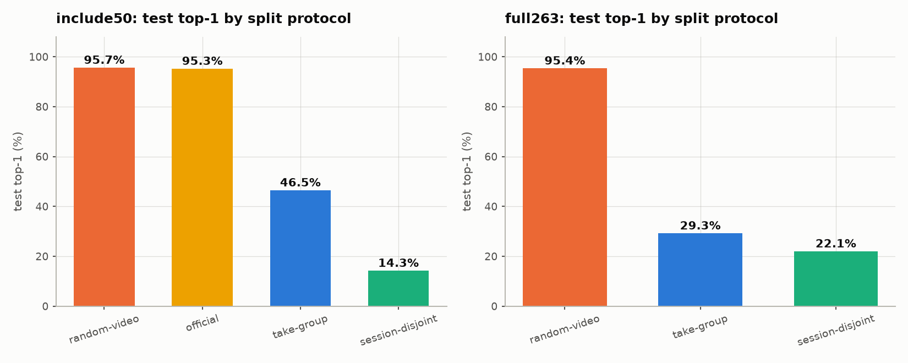

# ISL-ViT-Tiny

**A compact factorised Vision Transformer for Indian Sign Language recognition, sized for smart-glasses deployment — and an honest account of what its benchmark numbers actually mean.**

| | |
|---|---|
| Parameters | **3.80 M** |
| Compute | **0.824 GMACs / clip** |
| Model size (INT8) | **≈ 3.8 MB** |
| Latency (desktop CPU, 1 clip) | **12 ms** |
| Input | 8 frames × 3 streams (L hand, R hand, face) × 64×64 RGB |
| Vocabulary | 50 (development) / 262 (full) signs |

**[Full technical report →](docs/PRELIMINARY_MODEL_REPORT.md)** — 19 sections, architecture diagrams, ablations, error analysis, reproducibility appendix.

---

## Headline results

Best configuration, INCLUDE-50, `session-disjoint` protocol:

| Metric | Value |
|---|---|
| Top-1 | **68.9 %** |
| Top-5 | **89.4 %** |
| Accuracy under confidence gating | **80.7 %** on the 76 % of clips the model commits to |

The cumulative trajectory on one unchanged test set is **51.7 % → 59.7 % → 68.9 %** — about +17 points, **none of it architectural**.

## The measurement problem this project is really about

Published INCLUDE numbers sit around 94–95 %. This model reproduces that. It is also **mostly an artefact of the split.**

INCLUDE is recorded as back-to-back takes within shared studio sessions, so a random split puts near-duplicate frames of the same take on both sides of the train/test boundary. Building take-group and session-disjoint protocols to remove that:



*The same model and the same training recipe throughout — only the split file changes.*


| Protocol | What it removes | INCLUDE-50 | INCLUDE-263 |
|---|---|---|---|
| `random-video` | nothing | 95.7 % | 94.5 % |
| `official` | nothing | 95.3 % | — |
| `take-group` | near-duplicate takes | 46.5 % | 29.3 % |
| **`session-disjoint`** | **signer / room / lighting** | 31.3 % (balanced) | **22.1 %** |

Roughly **65 points** of the standard benchmark is attributable to near-duplicate takes, and a further **7 points** to shared recording conditions.

## What actually moved the honest number

Measured against a multi-seed noise floor, not single runs:

| Intervention | Effect |
|---|---|
| Training on 45 % more of INCLUDE's own data | **+7.7** |
| Resolution-matched CISLR pretraining | **+9.5** |
| Frame count 8 → 16 | **+6.4** |
| Training 250 → 2,000 epochs | **+7.9** |
| Test-time augmentation | **+2.5** |
| Scaling pretraining to iSign (18k clips) | further gain |

Rejected after controlled testing: **grokking** (negative in both weight-decay arms), **strong augmentation** (top-1 null, measurably worse calibration), **resolution jitter during pretraining** (sd 4.2 vs 0.1 — less predictable, no gain), and a **labelled-CISLR merge**.

Three claims in this project were made against a weak reference or too few seeds and later **overturned by properly controlled follow-ups** — including one reversal of a previous correction. The report documents each rather than quietly editing them out.

## The binding limitation

Every figure above is measured *inside INCLUDE*. Evaluated on a genuinely different corpus — CISLR, with different signers, rooms and cameras — the same checkpoints score **0.3–1.5 %, at chance**, including the ones reaching 42 % on INCLUDE.

This is not a label-mismatch artefact: retrieval confirms the two corpora sign the same gestures 10× better than chance, and 1-NN on the features scores the same as the classifier, locating the failure in the **representation** rather than the head. A `backbone_lr_scale` sweep falsified the hypothesis that finetuning was erasing transferable features.

**Every accuracy here should be read as "on INCLUDE-like video."** No measurement in this repository supports a claim of general ISL recognition. [docs/CAPTURE_PROTOCOL.md](docs/CAPTURE_PROTOCOL.md) is the recording protocol designed to close that gap with new signers.

## Architecture

A naive video ViT attends jointly over all patches of all frames: `O((T·S·P)²)`. Factorising into a spatial encoder (within a crop) followed by a temporal encoder (across crops) gives `O(P²) + O((T·S)²)` — **≈ 0.02× the attention cost**, which is what makes the model fit an edge budget at all.

```
Input (B, T=8, S=3, 3, 64, 64)
  |
  |-- STAGE A -- Spatial encoder (weights shared across all 24 crops)
  |     Conv2d patch embed 3->192 (k=16, s=16) -> 16 patches
  |     + CLS + positional embedding -> 17 tokens x 192
  |     4 x Transformer block (dim 192, 3 heads, MLP ratio 4)
  |
  |-- TOKEN CONDITIONING
  |     + stream embedding + time embedding
  |     + geometry projection (box centre x/y, size -> 192, zero-init)
  |     + missing embedding where the box is unreliable
  |
  |-- STAGE B -- Temporal encoder
  |     prepend CLS -> 25 tokens x 192
  |     4 x Transformer block
  |
  `-- Linear 192 -> n_classes
```

Two design decisions carry most of the weight:

- **The model never sees a full frame.** Three MediaPipe-derived crops per timestep (left hand, right hand, face) remove the studio wall, furniture and clothing as class cues, and recover hand detail that would otherwise occupy ~10 % of frame width.
- **Cropping deletes hand *location*, which is a defining linguistic parameter of a sign.** Box geometry is fed back as an explicit 3-number feature through a **zero-initialised** projection, so the model starts as a pure appearance model and learns to use location gradually.

Width is pinned to **192** so ImageNet DeiT-Tiny weights load directly into Stage A without projection.

## Data pipeline

MediaPipe Holistic for pose / face / hand landmarks, with a **two-stage rescue** for missed hands: crop the predicted ROI, upscale to 256 px, re-run HandLandmarker; if still missing, carry the nearest real detection forward and flag the token as unreliable. Crops are written to a memmap cache alongside their box geometry and detection source.

One non-obvious finding worth flagging: CISLR crops are **2.1× blurrier** than INCLUDE's (their hands are upscaled from ~78 native px, against INCLUDE's downscaled ~173). A model pretrained on them had to unlearn that blur before its features were usable, which made cross-corpus pretraining look worthless (+1.9 pts, indistinguishable from noise). Matching the resolution distribution at finetuning time reversed the finding entirely — 22.1 % → 39.9 ± 0.1 %.

## Repository layout

```
islvit/
  models/isl_vit.py     factorised spatio-temporal ViT
  data/                 crop extraction, caching, splits, cross-corpus builders
  train.py  eval.py     training loop, protocol evaluation
  pretrain.py           CISLR / iSign pretraining
  tta.py  gate.py       test-time augmentation, confidence gating
  figures.py report.py  every figure and table in the report
configs/                YAML configs, one per experiment
splits/                 19 split definitions -- the four protocols, plus cross-corpus
runs/                   75 runs: summary.json + history.csv (checkpoints not tracked)
docs/                   technical report, figures, capture protocol
run_*.sh                the experiment scripts, one per investigation
```

## What is deliberately not in this repository

No source video, no preprocessed caches, no model checkpoints. All three are large and all three are reproducible:

| Excluded | Size | How to get it back |
|---|---|---|
| Source corpora (INCLUDE, CISLR, iSign, ISL-CSLTR) | ~57 GB | Download from the original sources below |
| Crop caches (`cache*/`) | ~70 GB | Regenerate with `islvit.data.crops` |
| Checkpoints (`*.pt`) | ~1 GB | Retrain via the `run_*.sh` script for that experiment |

What *is* tracked is everything needed to verify the claims: all code, all configs, all 19 split definitions, and per-run `summary.json` / `history.csv` for all 75 runs — every accuracy value in the report is read directly from those files. See §19.2 of the report for the full reproduction sequence.

## Data sources

- **INCLUDE** — Sridhar et al., ACM MM 2020. Zenodo record 4010759. CC-BY-4.0. 4,257 clips, 262 word-level signs, 1920×1080 @ 25 fps, single studio in Chennai.
- **CISLR** — pretraining corpus and cross-corpus test set.
- **iSign** — 18,000 clips from ~11,000 distinct source videos, used for scaled pretraining.
- **ISL-CSLTR** — continuous-signing corpus, used for auxiliary experiments.

Each is obtained from its original source under its own licence; none is redistributed here.

## Environment

| | |
|---|---|
| GPU | NVIDIA GeForce RTX 3060, 12 GB |
| RAM | 32 GB |
| OS | Windows 11 |
| Python | 3.11 |
| PyTorch | 2.6.0 + cu124 |
| MediaPipe | 1.0.0 (Tasks API) |
| timm | 1.0.28 |
| Seeds | 0 (training), 1337 (split construction) |

## Status

Active research work-in-progress, started July 2026. The report is versioned as *preliminary* deliberately — several results in it are corrections of earlier results in the same document.
