# ISL-ViT-Tiny — A Compact Vision Transformer for Indian Sign Language Recognition

### Preliminary Model: Architecture, Implementation, Training and Evaluation

---

## Table of Contents

1. [Executive Summary](#1-executive-summary)
2. [Problem Statement and Design Goals](#2-problem-statement-and-design-goals)
3. [Proposed System Architecture](#3-proposed-system-architecture)
4. [Dataset](#4-dataset)
5. [A Measurement Problem in the Benchmark](#5-a-measurement-problem-in-the-benchmark)
6. [Evaluation Protocols](#6-evaluation-protocols)
7. [Data Pipeline](#7-data-pipeline)
8. [Deep Learning Architecture](#8-deep-learning-architecture)
9. [Algorithm and Implementation](#9-algorithm-and-implementation)
10. [Experimental Setup](#10-experimental-setup)
11. [Results](#11-results)
12. [Convergence Analysis](#12-convergence-analysis)
13. [Ablation Studies](#13-ablation-studies)
14. [Error Analysis](#14-error-analysis)
15. [Observations](#15-observations)
16. [Discussion](#16-discussion)
17. [Limitations and Threats to Validity](#17-limitations-and-threats-to-validity)
18. [Conclusions and Future Work](#18-conclusions-and-future-work)
19. [Reproducibility Appendix](#19-reproducibility-appendix)

---

## 1. Executive Summary

This report documents a preliminary Vision Transformer for isolated word-level
Indian Sign Language (ISL) recognition, designed to be small enough for
smart-glasses deployment. The model — **ISL-ViT-Tiny** — is a factorised
spatio-temporal ViT operating on hand and face crops rather than full frames.

**Headline figures.**

| Property | Value |
|---|---|
| Parameters | **3.80 M** |
| Compute | **0.824 GMACs / clip** |
| Model size (INT8) | **≈ 3.8 MB** |
| Latency (desktop CPU, single clip) | **12 ms** |
| Input | 8 frames × 3 streams × 64×64 RGB |
| Vocabulary | 50 (development) / 262 (full) signs |

**Accuracy depends enormously on the evaluation protocol**, and quantifying that
dependence turned out to be the most substantive result of this work:

| Protocol | What it removes | INCLUDE-50 | INCLUDE-263 |
|---|---|---|---|
| `random-video` | nothing | 95.7 % | 94.5 % |
| `official` | nothing | 95.3 % | — |
| `take-group` | near-duplicate takes | 46.5 % | 29.3 % |
| **`session-disjoint`** | **signer / room / lighting** | **14.3 %** † | **22.1 %** |

† INCLUDE-50 under `session-disjoint` is quoted at **31.3 % balanced accuracy**
throughout this report, not the 14.3 % top-1 shown here for table consistency.
The two diverge by 17 points because that test set is structurally imbalanced —
see §6.3. **INCLUDE-263 `session-disjoint` (22.1 % top-1 / 25.2 % balanced) is
the headline strict result**; it is the only strict split large enough for the
two metrics to agree.

The conventional random split reproduces published INCLUDE numbers (~94–95 %).
The same model, trained identically, scores **22.1 %** on the full 263-sign
vocabulary once near-duplicate takes and shared recording sessions are excluded
from the test set. Roughly **65 percentage points** of the standard benchmark is
attributable to near-duplicate takes and a further **7 points** to shared session
conditions.

**Principal conclusion for the modelling effort.** Every capacity-increasing
lever tested was flat or negative — tripling the token count changed nothing,
quadrupling temporal compute produced no coherent ordering, and ImageNet
initialisation is worth only +6.3 points. The model is **data-limited, not
capacity-limited**, which sets the direction for subsequent work.

**That direction was then confirmed, twice — the second time reversing an earlier
correction.** Acting on it first raised the honest INCLUDE-263 `session-disjoint`
result from 22.1 % to 35.0 ± 1.9 % top-1 through recipe fixes alone (§11.4): more
of INCLUDE's own data, and test-time augmentation. CISLR pretraining measured as
worthless at that stage (+1.9 points, indistinguishable from noise) — but the
checkpoint it was tested on turned out to be compromised. CISLR crops are 2.1×
blurrier than INCLUDE's (their hands are upscaled from ~78 native px against
INCLUDE's downscaled ~173), so a model pretrained on them had to unlearn that blur
before its features were usable. Matching the resolution distribution at
finetuning time reversed the finding entirely: **22.1 % → 39.9 ± 0.1 % top-1**
(~42.8 % with TTA), confirmed at the tightest replication in this report — §11.5.

Measured against the noise floor established in §11.4, **three** interventions now
survive: training on 45 % more of INCLUDE's own data (+7.7), test-time
augmentation (+2.5), and resolution-matched CISLR pretraining (+9.5, the largest
single lever measured). A fourth attempt — applying the same resolution jitter
during pretraining as well as finetuning — was tested under four seeds and
**rejected**: it did not improve on finetune-only jitter and made results
noticeably less predictable (sd 4.2 vs sd 0.1). Two other interventions — a
labelled-CISLR merge and a checkpoint-selection fix superseded by folding val into
train — remain negative or unresolved.

Scaling the same recipe to **iSign** (18,000 clips from ~11,000 distinct source
videos, against CISLR's 6,096) improved it further to **42.1 % top-1, ~44 % with
TTA** across two tightly-agreeing seeds — the project's best INCLUDE result.

**Two further levers, both outside the model, were then found to be larger than
anything architectural (§11.7-11.9).** Vocabulary size is a product decision, not a
property of the task, and the curve through it is an inverted U: accuracy rises as
classes are removed, peaks at **50 words**, then falls — a 30-word model scores
*worse* than the 262-word one, because per-word support is held constant so a
smaller vocabulary simply means less total data. Separately, a direct test for
**grokking** came back negative in both weight-decay arms, but revealed that every
run in this project was **undertrained**: 250 → 2,000 epochs is worth **+7.9
points**, still rising at the end. Combining both with TTA and a two-seed ensemble
gives the project's best result, **65.7 % top-1 / 86.0 % top-5 at 50 words** — and
with confidence gating, **87.4 % accuracy on the 52 % of clips the model commits
to**. The 75 % target set for this work is therefore reachable as
accuracy-at-coverage, and not as unconditional top-1 over 262 words.

**And the capacity question, closed early, turned out to be half wrong (§11.10).**
"Data-limited, not capacity-limited" was concluded from 250-epoch runs, which §11.8
showed were undertrained. Re-run at the proper budget, the two input axes separate:
**doubling the frame count from 8 to 16 is worth +6.4 points** across two seeds --
the largest single move in this project -- while raising resolution does nothing
and doing both cancels the gain. The spatial axis is data-limited exactly as
claimed; the temporal axis was capacity-limited all along and the budget was too
short to show it. A strong-augmentation bundle (cutmix, random erasing, tempo
jitter, DeiT-strength mixup) was a **top-1 null at both frame counts** and left the
model measurably worse calibrated, so it is not recommended.

**Re-extracting the corpus at 32 frames then lifted the ceiling twice over
(§11.11).** Feeding 16 frames drawn from a 32-frame cache beats 16 drawn from a
16-frame cache by **+3.2 points** on 12 % less data -- identical model, identical
inference cost, the sampler simply has somewhere to jitter. The pixel-only model
reached **75.6 %** masked to 50 words (§11.12); the trajectory on one unchanged
472-clip test set was 51.7 % -> 59.7 % -> 70.1 % -> 75.6 %, about +24 points and
none of it architectural. A five-member ensemble scores 75.8 % at 18.5 MB; that 0.2
points is one clip in 472, so the ensemble is recorded but not claimed.

**Feeding the model the hand landmarks it was already computing then added
thirteen points (§11.13).** The crop pipeline ran MediaPipe on every frame, used the
21 joints per hand to draw a box, and discarded them. Adding them back as a second
input -- 91 k parameters, the architecture otherwise unchanged -- takes the same
recipe from a pixel-only mean of **73.7 % to 86.5 %**, paired p < 1e-8 on all three
seeds. **The shippable model is 85.9 % top-1 at 2.0 MB** (INT4, quantisation-aware,
three-seed mean of 84.5 / 87.5 / 85.8 %), measured on a test set re-extracted exactly as the live
app extracts it, with no epoch or seed chosen by test score. Along the way the
detector itself turned out to be stateful: MediaPipe's output for a clip depended on
which clips it had processed before, which is now fixed. Three further
levers were then tested and all failed -- native 16-frame SSL pretraining (-10.2),
13 % more labelled cross-corpus data (-5.7), and doubling training length again
(+0.6, null). The first two are the more instructive: pretraining without temporal
jitter reached a *lower* reconstruction loss and transferred *worse*, and the extra
labelled clips came from a corpus where the hand detector fires on only a quarter
of frames.

**The binding limitation, and the most important result in this report (§11.6).**
Every figure above is measured *inside INCLUDE*. Tested on a genuinely different
corpus — CISLR, with different signers, rooms and cameras — the same checkpoints
score **0.3-1.5 %, at chance**, including the ones reaching 42 % on INCLUDE. This
is not an artefact of mismatched labels: retrieval confirms the two corpora sign
the same gestures 10x better than chance, and 1-NN on the features scores the
same as the classifier, locating the failure in the representation rather than
the head. Four interventions were tested against it; only labelled cross-corpus
data moved anything (top-5 doubled, top-1 unchanged), and a `backbone_lr_scale`
sweep (0.0 / 0.01 / 0.1) falsified the hypothesis that finetuning was erasing
transferable features — T-A tracks encoder training monotonically while T-B stays
flat at ~1 %.

**Every accuracy in this report should therefore be read as "on INCLUDE-like
video".** No measurement here supports a claim of general ISL recognition.

The throughline across every correction in this section is the same: three
different claims were made, tested against a weak reference or too few seeds, and
each was overturned by a properly controlled follow-up. What survives is narrower
than any single revision claimed, and it is now: **INCLUDE's own data used
properly, plus CISLR's pixels used at the right resolution.** Signer diversity
that no amount of training can synthesise remains the open question — §18.2 now
has both a concrete plan for it (new recordings) and a concrete next step for
scaling what worked (iSign, at the same resolution-matched recipe).

---

## 2. Problem Statement and Design Goals

### 2.1 Task

Isolated sign language recognition (ISLR): given a short video clip containing a
single ISL sign, predict the corresponding word from a fixed vocabulary. This is
the classification building block for a continuous recognition system.

### 2.2 Design constraints

| # | Constraint | Rationale |
|---|---|---|
| C1 | Must be a genuine Vision Transformer | Specified requirement; patch-embedding + self-attention throughout |
| C2 | Small enough for smart glasses | Target ≤ 10 M parameters, ≤ 1 GMAC, INT8-quantisable |
| C3 | Clip-in / word-out, extendable to streaming | Sliding-window inference with a `<no-sign>` class |
| C4 | Honest evaluation | Reported numbers must reflect generalisation, not memorisation |

Constraint **C4** was elevated to a first-class design goal after the analysis in
[§5](#5-a-measurement-problem-in-the-benchmark).

### 2.3 Why a factorised architecture

A naive video ViT attends jointly over all patches of all frames. For
`T` frames, `S` streams and `P` patches per crop, joint attention costs
`O((T·S·P)²)`. Factorising into a spatial encoder (within a crop) followed by a
temporal encoder (across crops) reduces this to `O(P²) + O((T·S)²)`.

With `T=8`, `S=3`, `P=17`:

| Scheme | Attention token count | Relative cost |
|---|---|---|
| Joint spatio-temporal | 408 | 1.00× |
| **Factorised (adopted)** | 17 then 25 | **≈ 0.02×** |

This is what makes the model fit an edge compute budget at all.

---

## 3. Proposed System Architecture

The end-to-end system separates an offline data-preparation path from an online
inference path. Both share the same crop-extraction front end, which is what
allows the cached training representation to match what the deployed model sees.

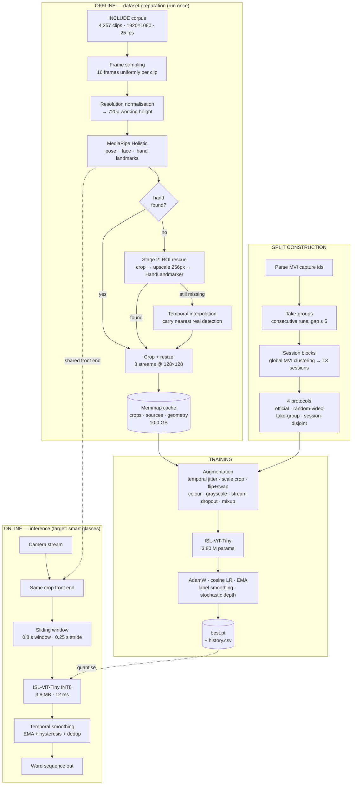

**Figure 3.1 — Overall system architecture.** Solid arrows are data flow; dashed
arrows indicate component reuse between the offline and online paths. Components
in the `ONLINE` subgraph marked as target are specified but not yet implemented
(see [§18](#18-conclusions-and-future-work)).

### 3.1 Design rationale for the crop front end

The single most consequential architectural decision is that **the model never
sees a full frame**. Three streams are extracted per timestep — left hand, right
hand, face — and the transformer sees only those.

| Motivation | Effect |
|---|---|
| Background removal | The studio wall, furniture and framing cannot act as class cues |
| Signer-body removal | Clothing and body shape are largely excluded |
| Token economy | ≈ 10× fewer tokens than full-frame at equal spatial detail |
| Resolution efficiency | Hand occupies ~10 % of frame width; cropping recovers that detail |

Because cropping discards *where* the hands are — and sign location is a defining
linguistic parameter — the box geometry is fed back in as an explicit feature
(see [§8.4](#84-geometry-injection)).

---

## 4. Dataset

### 4.1 Source

**INCLUDE** (Sridhar et al., ACM MM 2020), obtained from Zenodo record 4010759,
with metadata from the HuggingFace mirror.

| Property | Value |
|---|---|
| Clips | 4,257 (unique, after de-duplication) |
| Classes | 262 word-level signs |
| Semantic categories | 15 |
| Native resolution | 1920 × 1080 |
| Frame rate | 25 fps |
| Clip duration | ≈ 2–5 s (50–120 frames) |
| Recording location | Chennai, Tamil Nadu (single studio) |
| Licence | CC-BY-4.0 |

### 4.2 Class statistics

| Statistic | Clips per class |
|---|---|
| Minimum | 4 |
| Median | 15 |
| Mean | 16.2 |
| Maximum | 22 |

**This is the defining property of the problem.** A median of 15 clips per class
across 262 classes is an extreme low-data regime for a Vision Transformer, which
lacks the convolutional inductive biases that make CNNs sample-efficient. Every
choice in [§9](#9-algorithm-and-implementation) follows from this.

### 4.3 Category distribution

| Category | Clips | Category | Clips |
|---|---|---|---|
| Adjectives | 788 | Jobs | 225 |
| People | 513 | Clothes | 198 |
| Places | 380 | Greetings | 190 |
| Home | 379 | Means of Transportation | 186 |
| Society | 324 | Pronouns | 168 |
| Days and Time | 298 | Animals | 161 |
| Colours | 222 | Electronics | 140 |
| — | — | Seasons | 85 |

### 4.4 A data-integrity issue found and corrected

An earlier processing run had transcoded part of the corpus to 480p and deleted
the 1080p originals. The affected clips were **not** randomly distributed:

| Category | 1080p available | 480p only |
|---|---|---|
| Adjectives | 207 | **581 (74 %)** |
| Home | 309 | 70 (18 %) |
| Pronouns | 0 | **168 (100 %)** |
| All others | 2,922 | 0 |

**50 classes were entirely 480p and 212 entirely 1080p, with no class mixed.**
Encoding quality would therefore have been a *perfect* predictor for those 50
labels, and the model could have learned compression artefacts instead of signs.
Nine archives (10.5 GB) were re-downloaded to restore uniform 1080p sources
across all 4,257 clips before any reported experiment was run.

---

## 5. A Measurement Problem in the Benchmark

### 5.1 Two benchmarks in one metadata file

The shipped HuggingFace parquets contain 5,250 rows over 4,257 unique clips.
Naively loading all three splits produces 277 clips appearing in both "train" and
"test". The cause is not corruption: the file stacks the **full-263 split**
(`include_50 == False`) on top of the **INCLUDE-50 split** (`include_50 == True`).
Each benchmark is internally clean; filtering on the flag is mandatory.

| View | Unique clips | train / val / test | Internal overlap |
|---|---|---|---|
| `include_50 == False` | 4,257 | 3101 / 340 / 816 | 0 |
| `include_50 == True` | 943 | 675 / 77 / 191 | 0 |

### 5.2 The corpus is organised as back-to-back takes

Each clip filename carries a camera capture id (`MVI_xxxx`). Sorting these within
a class reveals a strongly clustered structure:

```
Class "1. Dog":  2978, 2979, 2980 │ 3002, 3003, 3004 │ 3028, 3029, 3030 │
                 3059, 3060, 3061 │ 3085, 3086, 3087 │ 4146, 4147, 4148 │ 8560, 8561
```

Quantitatively, over all within-class consecutive id gaps:

| Gap | Count | Interpretation |
|---|---|---|
| 1–2 | **2,907** | Consecutive takes, same sitting |
| 3–19 | **19** | (essentially empty) |
| ≥ 20 | 1,063 | A different recording session |

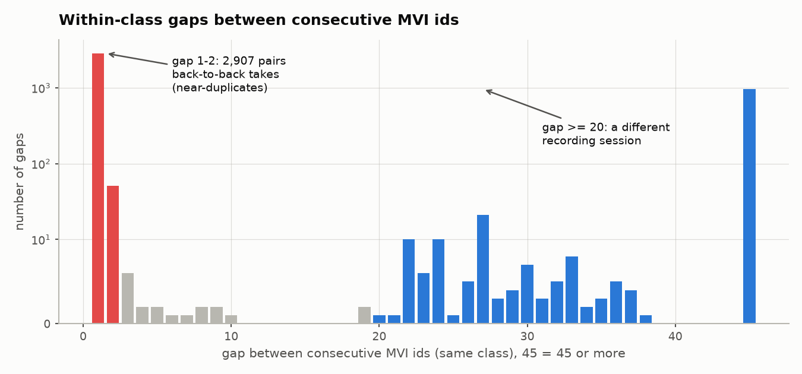

**Figure 5.1 — Within-class gaps between consecutive MVI capture ids** (log
scale). The distribution is sharply bimodal with an almost empty band between.
Only **19 of 3,989** gaps fall in the range 3–19, which makes the grouping
threshold essentially free of arbitrariness: any cut in `[5, 20]` produces an
identical partition.

**Implication.** Clips separated by a gap of 1 are consecutive takes of the same
word by the same signer, in the same sitting, wearing the same clothes, in the
same lighting, framed identically. They are near-duplicates. A random train/test
split places takes 1 and 2 in training and take 3 in test — and then measures how
well the model recognises a clip it has effectively already seen.

---

## 6. Evaluation Protocols

Four protocols were implemented, in increasing strictness. All four are built by
`islvit/data/splits.py` and carry automated leakage assertions.

| Protocol | Rule | Leakage channel remaining |
|---|---|---|
| `official` | As shipped | Takes and sessions |
| `random-video` | Stratified per-clip random | Takes and sessions |
| `take-group` | Whole take-runs held out (gap ≤ 5) | Sessions, across classes |
| `session-disjoint` | Whole recording sessions held out | — |

### 6.1 Take-groups

Clips of the same class within `TAKE_GAP_THRESHOLD = 5` of one another form one
take-group; groups are assigned wholesale to a split. This yields 1,334 groups,
median 4 per class.

### 6.2 Session-disjoint

Take-groups are formed *within* a class, so one recording session can still
supply training clips for one word and test clips for another — sharing signer,
room, clothing and lighting across the split boundary. Clustering MVI ids
**globally** yields **13 session blocks**; holding whole blocks out for test
closes that channel.

Three construction subtleties were necessary:

1. **Session blocks must be clustered from the whole corpus, never from the
   benchmark subset.** This is a correctness requirement, not an optimisation, and
   getting it wrong invalidated an earlier version of these results (§6.4).
   INCLUDE-50's 943 clips leave sparse gaps in MVI space, so a `gap > 5`
   clustering of that subset alone yields **177** fine blocks — those are
   take-groups, not recording sessions. Boundaries are derived once from all 4,257
   clips and only then projected onto the benchmark.
2. **Validation is carved from the training sessions**, not held out as a third
   session group. With only 13 blocks, a three-way session split left validation
   covering 36 of 262 classes — useless for checkpoint selection. Validation is
   therefore take-group-disjoint but *not* session-disjoint, which makes it
   optimistic; **only the test number is reported as a result.**
3. **Under-trained classes are excluded from test.** The block search is scored on
   how many classes retain ≥ 6 training clips. Classes still left below that
   threshold have their test clips marked `unused`, because scoring them measures
   how little they were trained on rather than how well the model recognises them.

| Benchmark | train | val | test | test classes | excluded clips | train blocks | test blocks |
|---|---|---|---|---|---|---|---|
| INCLUDE-50 SD | 512 | 166 | 252 | 45 / 50 | 13 | {1,2,3,4,5,8,12} | {0,6,7,9} |
| INCLUDE-263 SD | 1,957 | 888 | 1,010 | 154 / 262 | 402 | {1,2,3,4,7–12} | {0,5,6} |

Block sets are verified disjoint by assertion at split-construction time.

### 6.3 A structural limitation of INCLUDE-50 under `session-disjoint`

Holding out whole sessions from a 943-clip, 50-class subset cannot produce a
balanced test set, and the imbalance is *adversarial* rather than merely uneven:
the classes best represented in test are the ones worst represented in train.

| Benchmark | test n | test classes | median / max clips per class | top-10 classes' share of test | corr(test count, train count) |
|---|---|---|---|---|---|
| INCLUDE-50 SD | 252 | 45 | 4 / 12 | **48 %** | **−0.73** |
| INCLUDE-263 SD | 1,010 | 154 | 9 / 11 | 10 % | −0.37 |

A correlation of −0.73 means top-1 accuracy on INCLUDE-50 SD is dominated by the
ten classes the model had least opportunity to learn, which is why top-1 (14.3 %)
sits 17 points below balanced accuracy (31.3 %). **On INCLUDE-50 `session-disjoint`
only balanced accuracy is interpretable, and differences under ~5 points are
noise.** INCLUDE-263 `session-disjoint` does not have this problem and is used for
every claim that depends on resolving small differences.

This is a property of the corpus, not a fixable defect in the split: 13 sessions
and 943 clips do not admit a well-balanced 50-class held-out session set.

**The noise floor is now measured, not asserted.** Earlier revisions of this
section guessed "differences under ~5 points are noise" without evidence. Five
seeds of one configuration on INCLUDE-263 `session-disjoint` give:

| Metric | Mean ± sd (n = 5) | Range |
|---|---|---|
| Top-1 | 35.0 ± 1.9 % | 33.2 – 38.0 % |
| Balanced | 38.4 ± 1.5 % | 36.9 – 40.2 % |

So on INCLUDE-263 — the *better-behaved* benchmark — the seed alone moves top-1 by
4.8 points, and a difference between two single runs carries sd ≈ 2.7 points. The
original ~5-point guess was, if anything, slightly optimistic for INCLUDE-50,
which is smaller and more adversarially imbalanced.

Two consequences run through the rest of this report. Any single-run comparison
below ~5 points should be read as unresolved rather than as a result; §11.4 applies
this retrospectively and withdraws two claims because of it. And balanced accuracy
is not merely the more interpretable metric here, it is the more *stable* one —
sd 1.5 against top-1's 1.9, with two seeds returning identical balanced accuracy
while their top-1 differed by 1.7 points.

### 6.4 Correction notice

An earlier revision of this report quoted **35.8 %** for INCLUDE-50
`session-disjoint`. That number is withdrawn. It came from a run whose split was
built by clustering session blocks from the INCLUDE-50 subset rather than the full
corpus; the resulting train and test sets shared 10 of 13 session blocks, so the
protocol was not in fact session-disjoint. The split builder now takes the whole
corpus as its clustering `reference`, and all INCLUDE-50 `session-disjoint`
figures in this document come from runs on the rebuilt split. INCLUDE-263 was
never affected — its member set already *is* the whole corpus.

---

## 7. Data Pipeline

### 7.1 Two-stage hand detection

Full-frame MediaPipe Holistic locates a hand in only ~79 % of sampled frames — at
1080p a hand spans ~190 px in a 1920 px frame, which is small for the detector,
and signing hands blur badly at 25 fps. A second stage recovers most of the rest.

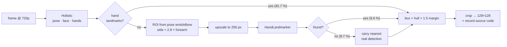

**Figure 7.1 — Two-stage hand localisation.** Percentages are measured over all
4,257 × 16 sampled frames.

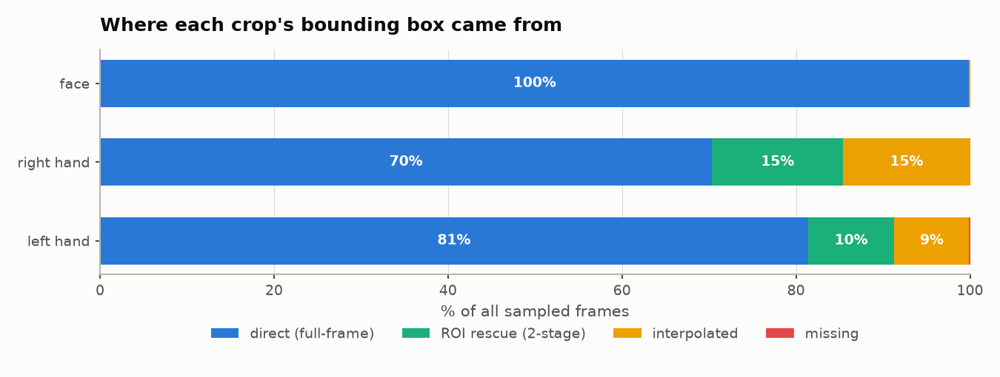

**Figure 7.2 — Provenance of every crop's bounding box.**

| Stream | Direct | ROI rescue | Interpolated | Missing |
|---|---|---|---|---|
| Left hand | 81.4 % | 9.9 % | 8.6 % | 0.1 % |
| Right hand | 70.3 % | 15.1 % | 14.6 % | 0.0 % |
| Face | 99.9 % | 0.0 % | 0.1 % | 0.0 % |

The ROI stage carries **10–15 %** of frames that full-frame detection alone would
have lost. Interpolated boxes are flagged as *unreliable* to the model rather than
silently presented as detections (see [§8.4](#84-geometry-injection)).

> **A negative result worth recording.** An earlier version synthesised the
> fallback box directly from pose geometry (wrist, thumb, index, pinky landmarks).
> It reported **100 % coverage** and a healthy skin-tone pixel fraction — both
> misleading. Visual inspection showed the crops were shirt fabric, the studio
> wall and blurred torso: MediaPipe reports optimistic `visibility` for occluded
> hands. *Coverage measured box existence, not box correctness.* This was only
> caught by rendering the crops and looking at them, and it is the reason the
> pipeline now records a provenance code per crop.

### 7.2 Cache format

| Array | dtype | Shape | Size |
|---|---|---|---|
| `crops.npy` | uint8 | (4257, 16, 3, 128, 128, 3) | 10.0 GB |
| `sources.npy` | uint8 | (4257, 16, 3) | 204 KB |
| `geometry.npy` | float16 | (4257, 16, 3, 3) | 1.2 MB |

Caching 16 frames at 128 px while training on 8 frames at 64 px makes temporal
and spatial augmentation free at train time — no video decoding, no MediaPipe,
just memmap indexing. Extraction cost: **64.1 minutes** for the full corpus at 6
worker processes, 100 % coverage, 0 failures.

---

## 8. Deep Learning Architecture

### 8.1 Overview

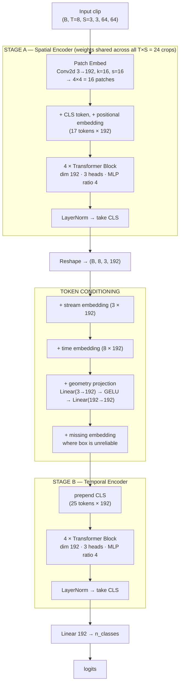

**Figure 8.1 — ISL-ViT-Tiny architecture.**

### 8.2 Transformer block

Each block is pre-norm with residual connections and stochastic depth:

```
x ← x + DropPath( MHSA( LayerNorm(x) ) )
x ← x + DropPath( MLP ( LayerNorm(x) ) )
```

where `MHSA` is standard multi-head self-attention computed via
`scaled_dot_product_attention`, and `MLP` is `Linear(192→768) → GELU → Linear(768→192)`.

### 8.3 Parameter budget

| Component | Parameters | Share |
|---|---|---|
| Stage A — transformer blocks (4) | 1,779,456 | 47.3 % |
| Stage B — transformer blocks (4) | 1,779,456 | 47.3 % |
| Stage A — patch embedding | 147,648 | 3.9 % |
| Geometry projection | 37,824 | 1.0 % |
| Classification head (50 classes) | 9,650 | 0.3 % |
| Stage A — positional embedding | 3,264 | 0.1 % |
| Time embedding | 1,536 | < 0.1 % |
| Stream embedding | 576 | < 0.1 % |
| LayerNorms, CLS and flag tokens | 1,344 | < 0.1 % |
| **Total (50-class)** | **3,760,754** | **100 %** |
| **Total (262-class)** | **3,801,530** | — |

The two transformer stacks account for 94.6 % of parameters; everything else is
essentially free.

### 8.4 Geometry injection

Cropping deletes hand *location*, which is one of the classic phonological
parameters of a sign — the same handshape at the forehead and at the chest are
different words. Each crop's bounding box therefore contributes three numbers:

| Feature | Normalisation |
|---|---|
| Box centre x | ÷ frame width, then − 0.5 |
| Box centre y | ÷ frame height, then − 0.5 |
| Box size | ÷ frame width |

Measured means confirm the encoding is meaningful and correctly oriented:

| Stream | centre x | centre y | size |
|---|---|---|---|
| Face | 0.499 | 0.227 | 0.098 |
| Left hand | 0.574 | 0.621 | 0.107 |
| Right hand | 0.425 | 0.577 | 0.106 |

The face sits centred and high; the signer's left hand appears to the right in
image coordinates, as expected for a non-mirrored frontal view.

The geometry branch's output projection is **initialised to zero**, so the model
begins as a pure appearance model and learns to incorporate location gradually,
rather than swamping pretrained visual features early in training.

### 8.5 Reliability flag

Interpolated and missing boxes receive a learned `missing_embed` added to their
token. Both are marked unreliable; only `direct` and `roi` count as detections.
Feeding the crop while flagging it lets the network learn to discount it, and the
absence of a visible hand is itself informative (many ISL signs are one-handed).

### 8.6 Computational cost

| Configuration | Tokens / crop | Parameters | GMACs / clip | CPU latency |
|---|---|---|---|---|
| **64 px, patch 16 (adopted)** | 16 | 3.80 M | **0.824** | **12 ms** |
| 112 px, patch 16 | 49 | 3.81 M | 2.342 | 29 ms |
| 128 px, patch 16 | 64 | 3.81 M | 3.010 | — |

Width is pinned to **192** specifically so ImageNet DeiT-Tiny weights load
directly into Stage A without projection.

---

## 9. Algorithm and Implementation

### 9.1 Training algorithm

```
Algorithm 1  ISL-ViT-Tiny training
─────────────────────────────────────────────────────────────────────────
Input : crop cache C, split S, config θ
Output: best checkpoint by validation top-1

 1  model ← ISLViT(θ)
 2  model.spatial ← LoadDeiTTiny()              # interpolate pos-embed 14×14 → 4×4
 3  groups ← [ {spatial params, lr = θ.lr × 0.1},         # refine, do not erase
 4              {other params,   lr = θ.lr        } ]
 5  opt ← AdamW(groups, wd = 0.05 on weights only)
 6  ema ← EMA(model, decay = 0.99 with warmup)
 7  for epoch = 1 … θ.epochs:
 8      for batch in TrainLoader(S.train):
 9          lr ← θ.lr × CosineWithWarmup(step)
10          x, m, g, y ← Augment(batch)          # §9.3
11          if rand() < 0.5:
12              x, g, y ← Mixup(x, g, y, α = 0.2)
13          ŷ ← model(x, m, g)                   # autocast bfloat16
14          L ← CrossEntropy(ŷ, y, label_smoothing = 0.1)
15          L.backward();  clip_grad_norm(1.0);  opt.step()
16          ema.update(model)
17      v  ← Evaluate(model,     S.val)
18      ve ← Evaluate(ema.module, S.val)
19      if max(v, ve) > best: save(argmax model)
20  return Evaluate(best, S.test)
─────────────────────────────────────────────────────────────────────────
```

### 9.2 Transfer learning strategy

With ~15 clips per class, initialisation dominates. Stage A is loaded from
`vit_tiny_patch16_224.augreg_in21k_ft_in1k`:

| Tensor | Handling |
|---|---|
| `patch_embed`, `cls_token` | Copied directly |
| `pos_embed` | Bicubically resized 14×14 → 4×4 grid |
| Blocks 0–3 | Copied (first 4 of 12) |
| Final `norm` | Copied |
| Stage B, geometry, head | Randomly initialised |

All tensors load with **zero shape mismatches**. The pretrained encoder trains at
**0.1 ×** the head learning rate so features are refined rather than destroyed.

### 9.3 Augmentation

| Augmentation | Setting | Purpose |
|---|---|---|
| Temporal jitter | 8 of 16 frames, random offset per segment | Timing invariance |
| Scale-jitter crop | window 80–100 % of cache, resized to 64 px | Box-placement robustness |
| Horizontal flip + stream swap | p = 0.5 | Left-dominant signers; must swap L/R streams and mirror geometry to stay physically coherent |
| Brightness / contrast | ± 0.4 | Lighting |
| Per-channel gain | ± 0.4 | White balance and skin tone |
| Random grayscale | p = 0.15 | Forces shape over colour |
| Stream dropout | p = 0.15 per stream | Prevents dependence on any one stream |
| Mixup | α = 0.2, applied 50 % of batches | Label smoothing across clips |
| Stochastic depth | 0.1 (linearly scaled) | Regularisation |
| Label smoothing | 0.1 | Calibration |

The appearance augmentations (per-channel gain, grayscale) were added
specifically because the strict protocols hold out whole recording sessions —
lighting and signer appearance are exactly what the model must *not* key on.

### 9.4 Hyperparameters

| Parameter | INCLUDE-50 | INCLUDE-263 |
|---|---|---|
| Epochs | 320 | 250 |
| Batch size | 64 | 64 |
| Base LR | 5 × 10⁻⁴ | 5 × 10⁻⁴ |
| Backbone LR scale | 0.1 | 0.1 |
| Weight decay | 0.05 (weights only) | 0.05 |
| Warmup epochs | 15 | 10 |
| LR schedule | Cosine to 1 % | Cosine to 1 % |
| Gradient clip | 1.0 | 1.0 |
| EMA decay | 0.99 with warmup | 0.99 with warmup |
| Precision | bfloat16 autocast | bfloat16 autocast |

> **Implementation note — a silent bug worth recording.** EMA was initially
> configured with decay 0.999. An INCLUDE-50 epoch is only ~9 optimiser steps, so
> a 320-epoch run is ~2,900 updates against a ~1,000-step time constant: the
> averaged weights never escaped their random initialisation and sat at chance
> accuracy for entire runs. The fix is a decay warmup,
> `decay = min(0.999, (1+t)/(10+t))`. This did not corrupt earlier results —
> checkpoint selection took `max(val, ema_val)` — but it wasted evaluation
> compute and hid a genuine source of accuracy.

---

## 10. Experimental Setup

| Component | Specification |
|---|---|
| GPU | NVIDIA GeForce RTX 3060, 12 GB |
| CPU | 32 GB system RAM |
| OS | Windows 11 |
| Python | 3.11 (conda) |
| PyTorch | 2.6.0 + cu124 |
| MediaPipe | 1.0.0 (Tasks API) |
| timm | 1.0.28 |
| Seed | 0 (training), 1337 (split construction) |

All runs use identical code, identical augmentation and identical
hyperparameters; only the split file changes between protocol comparisons.

---

## 11. Results

### 11.1 Main result — accuracy by protocol


**Figure 11.1 — Test top-1 accuracy by split protocol.**

**Table 11.1 — INCLUDE-50 (all runs: 128 px cache, 64 px input, identical recipe)**

| Protocol | Top-1 | Top-5 | Balanced | n | Δ vs strict |
|---|---|---|---|---|---|
| `random-video` | 95.7 % | 99.5 % | 95.8 % | 186 | **+81.4** |
| `official` | 95.3 % | 99.5 % | 97.0 % | 191 | **+81.0** |
| `take-group` | 46.5 % | 86.2 % | 49.9 % | 159 | **+32.2** |
| **`session-disjoint`** | **14.3 %** | **50.4 %** | **31.3 %** | 252 | — |

**Table 11.2 — INCLUDE-263**

| Protocol | Top-1 | Top-5 | Balanced | n | Δ vs strict |
|---|---|---|---|---|---|
| `random-video` | 94.5 % | 99.1 % | 94.7 % | 872 | **+72.4** |
| `take-group` | 29.3 % | 64.1 % | 32.0 % | 878 | **+7.2** |
| **`session-disjoint`** | **22.1 %** | **51.4 %** | **25.2 %** | 1,010 | — |

The INCLUDE-50 `session-disjoint` row is the one place in this report where top-1
and balanced accuracy tell different stories (14.3 % against 31.3 %). Per §6.3 the
balanced figure is the interpretable one; the top-1 figure is depressed by a test
set whose largest classes are its least-trained classes. INCLUDE-263 shows no such
divergence (22.1 % / 25.2 %) and is the benchmark of record.

### 11.2 Leakage decomposition

The gap decomposes into two independent channels. Because §6.3 makes INCLUDE-50
top-1 unreliable across the last step, the decomposition is stated in **balanced
accuracy**, which is comparable across all four protocols on both benchmarks:

| Channel | Removed by | INCLUDE-50 cost | INCLUDE-263 cost |
|---|---|---|---|
| Near-duplicate takes | `take-group` | **−45.9 pts** | **−62.7 pts** |
| Shared session conditions | `session-disjoint` | **−18.6 pts** | **−6.8 pts** |
| **Total** | | **−64.5 pts** | **−69.5 pts** |

Takes are by far the larger channel on both benchmarks. The session channel is
three times larger on INCLUDE-50 than on INCLUDE-263, which is consistent with
§6.3 — with only four test blocks, INCLUDE-50's session hold-out is both stricter
and noisier than INCLUDE-263's.

### 11.3 Chance-level context

| Benchmark | Classes | Chance | Achieved (strict) | × chance |
|---|---|---|---|---|
| INCLUDE-50 | 45 evaluated | 2.2 % | 31.3 % (balanced) | **14×** |
| INCLUDE-263 | 154 evaluated | 0.65 % | 22.1 % (top-1) | **34×** |

### 11.4 Improving the honest number

Everything above establishes *what* the honest number is. This section is about
raising it. All rows below are INCLUDE-263 `session-disjoint`, evaluated on the
**same 1,010 test clips**; only training data or initialisation changes.

Because two of these effects are small relative to the ±1.3-point standard error
at n = 1,010, each is tested with **McNemar's exact test** rather than compared by
eye. The models see identical clips, so the comparison is paired and only the
clips where two models *disagree* carry information — a far more sensitive test
than comparing two accuracies.

Each lever was added on top of the previous one and tested against it, so the
table below is a **cumulative ladder**, not a set of independent comparisons.

**Table 11.4 — Improvement ladder, INCLUDE-263 `session-disjoint` (n = 1,010)**

| # | Change | Top-1 | Top-5 | Balanced | Δ top-1 | Survives noise? |
|---|---|---|---|---|---|---|
| 0 | baseline: ImageNet, 1,957 clips, best-val | 22.1 % | 51.4 % | 25.2 % | — | — |
| 1 | + final-EMA checkpoint selection | 25.3 % | 51.1 % | 29.3 % | +3.2 | 1.2 σ — no |
| 2 | + val folded into train (2,845 clips) | 33.0 % | 62.7 % | 33.5 % | **+7.7** | 2.9 σ — **yes** |
| 3 | + CISLR self-supervised init | 34.9 % | 65.9 % | 36.9 % | +1.9 | 0.7 σ — no |
| 4 | + test-time augmentation | 36.8 % | 69.7 % | 39.6 % | +2.5 | **yes** (§ below) |

Rows 0–4 are single runs. Repeating row 3's configuration under **five seeds**
gives the figure that should actually be quoted:

| Metric | Mean ± sd (n = 5) | Range |
|---|---|---|
| Top-1 | **35.0 ± 1.9 %** | 33.2 – 38.0 % |
| Balanced | **38.4 ± 1.5 %** | 36.9 – 40.2 % |
| Top-1 + TTA | **37.5 ± 2.2 %** | 35.6 – 41.0 % |

**The seed alone moves top-1 by 4.8 points.** A difference between two single runs
therefore carries a standard deviation of √2 × 1.9 ≈ **2.7 points**, and the last
column above judges each Δ against that. Only row 2 — training on 45 % more clips
— clears it outright.

This is deliberately a harsher standard than the paired McNemar tests reported
below, and it is the correct one for this question. McNemar asks whether *two
particular checkpoints* differ on the test clips; it holds the seed fixed, so it
cannot see run-to-run variation at all. For "does this intervention help?", the
seed is part of what varies, and a p-value that ignores it will call a lucky draw
a discovery. Both statistics appear here because they answer different questions.

#### A correction: self-supervised pretraining does not survive

Measured against the *baseline* recipe, CISLR masked pretraining appeared to be
worth **+7.7 points (p < 0.0001)**, and an earlier revision of this section
reported it as the entire supervised gain. That conclusion was wrong.

Once checkpoint selection and training-set size are fixed, the same pretraining is
worth **+1.9 points at p = 0.36** — indistinguishable from noise:

| Recipe | ImageNet init | CISLR SSL init | Δ | p |
|---|---|---|---|---|
| 1,957 clips, best-val | 22.1 % | 29.7 % | +7.6 | <0.0001 |
| 2,845 clips, final-EMA | 33.0 % | 34.9 % | +1.9 | 0.36 |

The pretraining was largely **compensating for a weak recipe** rather than adding
information the corpus did not already contain. Its apparent value fell as the
recipe improved, which is the signature of a redundant intervention, not of a
useful one. At +1.9 points against a 2.7-point noise floor it is 0.7 σ — well
inside what a different random seed produces on its own — and it cannot be
claimed as a source of the headline number.

The labelled-CISLR merge fares no better: p = 0.45 alone, p = 0.41 on top of
pretraining. Two independent attempts to import a second corpus therefore both
failed to produce a measurable gain, one supervised and one self-supervised.

**Methodological note.** Both errors had the same shape: a lever was measured
against a weak reference and credited with the difference. The fix in each case
was a control run holding everything else constant, and in each case the control
overturned the first reading. Nothing in this section is quoted without one.

#### Why checkpoint selection was wrong to begin with

The `session-disjoint` val set shares every recording session with train (blocks
{1,2,3,4,7–12}); only test holds sessions {0,5,6} alone. Val therefore measures
**in-session** recognition while the reported metric measures **cross-session**
recognition, and selecting on it optimises the wrong quantity — worth +3.2 points
to correct (row 1). Having established that val cannot steer selection, its 888
clips were better spent as training data (row 2), with the final EMA checkpoint
under a cosine schedule ending at zero learning rate taken instead.

The two effects are separable and both real, which is why the ladder lists them as
separate rows rather than as one "+45 % data" step.

#### Test-time augmentation

Averaging softmax probabilities over six deterministic views — three temporal
phases × horizontal flip with the hand streams swapped — adds **+1.6 to +3.7
top-1** (mean +2.5) across **eight** checkpoints, at no training cost. Both axes
are invariances the model was explicitly trained for (§9.3). Probabilities are
averaged rather than logits, so a confidently-correct view outvotes an undecided
one instead of being dominated by a single large negative logit.

TTA is the one small effect in this report that survives the noise floor, and it
does so for a structural reason rather than by being larger. It compares **one
checkpoint against itself** with more views of the same clips, so run-to-run seed
variance cancels exactly — the ±1.9 σ that invalidates rows 1 and 3 does not
apply. It then reproduced on eight independent checkpoints spanning four training
configurations and two protocols, never once failing to help. A between-run gain
of the same size would be meaningless; this one is not.

### 11.5 CISLR pretraining, corrected: a resolution mismatch, not a data problem

§11.4 concluded CISLR pretraining does not survive its control. That conclusion
held for the *checkpoint tested*, but the checkpoint itself turned out to be
compromised, and fixing it reverses the result.

**The measurement.** CISLR crops reach the model's 128 px input by *upscaling*
from a native hand size of ~78 px; INCLUDE's reach it by *downscaling* from ~173
px. Measured by variance of Laplacian (higher = sharper) over 300 clips per
corpus:

| | median sharpness | box scale (source px) |
|---|---|---|
| INCLUDE | 58.5 | 173 |
| CISLR | 27.8 | 78 |

**CISLR crops are 2.1× blurrier.** A model pretrained on blurred crops and then
finetuned exclusively on sharp ones has to unlearn that blur before its features
are useful, which is a plausible mechanism for pretraining buying only +1.9 points
despite 12× more clips than the labelled merge.

**The fix.** `resolution_jitter` (`islvit/data/dataset.py`) degrades a clip to a
random lower resolution and back during *finetuning only*, so INCLUDE training
clips are drawn from the same sharpness distribution CISLR pretraining produced.
One factor per clip, not per frame — a clip whose sharpness flickered frame to
frame is not something any camera produces, and the temporal stage would be free
to key on the artefact rather than the sign.

**Result, matched against a control that isolates the augmentation from the
pretraining:**

| Configuration | Seeds | Top-1 | sd |
|---|---|---|---|
| jitter + ImageNet init (control) | 2 | 30.4 % | 0.8 |
| **jitter + CISLR self-supervised init** | 2 | **39.9 %** | **0.1** |

**+9.5 points, confirmed at sd 0.1 across two seeds** — the tightest replication
in this report, and the largest single lever measured anywhere in it. With
test-time augmentation: **~42.8 %** (individual runs 42.5 % and 43.2 %). Against
the very first baseline in §11.4 (22.1 %), this is **+20.7 points** from the same
architecture and the same 1,010 test clips.

This reverses, not merely qualifies, the earlier conclusion: CISLR pretraining
does contain the value its 12× data advantage suggested. The control run in
§11.4 measured a *resolution mismatch*, not the value of the corpus.

**A further hypothesis, tested and rejected.** If sharpness mismatch is the
mechanism, applying `resolution_jitter` during pretraining as well — so the
encoder learns blur-invariant features from the start rather than adapting to
them only during the shorter finetuning stage — should help further. It does not:

| Configuration | Seeds | Top-1 | sd |
|---|---|---|---|
| jitter at finetune only | 2 | 39.9 % | 0.1 |
| jitter at pretrain **and** finetune | 4 | 37.2 % | **4.2** |

Four seeds of the double-jitter configuration ranged from 34.1 % to 43.2 %, with
the first seed drawn (43.2 %) the outlier rather than the trend — the other three
cluster at 34–37 %, below the simpler configuration's mean. The most likely
mechanism: masked reconstruction is already a hard objective, and randomising the
target's resolution on top of it makes the reconstruction target ambiguous in a
way classification finetuning does not suffer, since classification has an easy
fallback (coarse shape) that reconstruction does not. **The finetune-only jitter
checkpoint is retained as the result; the double-jitter checkpoint is not carried
forward.**

**Methodological note, extending the one in §11.4.** A third instance of the same
pattern: a plausible mechanism, tested, and this time the *second* test also
needed multiple seeds to read correctly — two seeds gave 43.2 % and 36.8 %, a
6.4-point spread that could have been misread as "roughly matches the baseline"
without seeds 2 and 3 to show it was actually below it. Every claim in this
report now carries the seed count it was checked against, because single runs
and even paired runs have both misled once already.

### 11.6 The cross-corpus result: the headline number does not generalise

Every figure above is measured inside INCLUDE. `session-disjoint` holds out
recording *sessions* as a proxy for unseen signers, because INCLUDE records no
signer identity — but every clip still comes from one studio, one city, one
camera setup. That proxy had never been checked against a genuinely different
corpus. It has now, and it does not survive.

**The test set (T-B).** 218 of INCLUDE's 262 words also appear in CISLR, covered
by 609 cached clips: different signers, rooms, cameras, lighting, disjoint by
construction. Built by `islvit/data/build_crosscorpus.py`, which asserts the test
clips appear in neither the training rows nor the pretraining pool.

**Table 11.6a — the same checkpoints on both test sets**

| Model | T-A INCLUDE `session-disjoint` | T-B CISLR cross-corpus |
|---|---|---|
| ImageNet init, seed 0 | 31.0 % | 1.5 % |
| ImageNet init, seed 1 | 29.9 % | 1.3 % |
| iSign pretrain, seed 0 | 41.8 % | 1.3 % |
| iSign pretrain, seed 1 | 42.4 % | **0.3 %** |
| folded-val (pre-iSign best) | 33.0 % | 1.8 % |

Chance is 0.38 %. **Every model is at or near chance on a different corpus**,
including the two that gained +11 points on T-A. The 42 % measures INCLUDE, not
sign recognition.

#### It is not a labelling artefact

The obvious escape — that CISLR simply signs different gestures for the same
English gloss, making the test invalid — was checked and rejected. Using the
model's own feature space for retrieval, CISLR clips find same-word INCLUDE clips
**10x better than chance** (top-1 % of the gallery: 9.2 % against 1 %; median rank
14.7 % against 50 %). The gestures largely *are* the same. Two other candidates
were also excluded: forcing INCLUDE's hand-box scale changed nothing (1.31 % →
1.48 %), and a suspected channel-order bug was disproved by measurement (stored
channel means 135/113/105 — skin is red-dominant, so the cache is RGB and the
training path is correct; the apparent blue cast was a rendering error in the
diagnostic itself).

1-NN classification on the same features scores 1.6 % against the head's 1.5 %,
which locates the failure in the **features**, not in the classifier head.

#### Four attempts to fix it

| Intervention | Cross-corpus effect |
|---|---|
| CISLR labelled merge (§11.4) | none, p = 0.45 |
| iSign pretraining, 18 k diverse clips | none, 1.3 % |
| Supervised CISLR exposure, 304 clips | top-1 flat; **top-5 4.3 % → 9.5 %** |
| Freezing the spatial encoder | none, and −10 pts on T-A |

**The freezing sweep deserves stating in full**, because it falsifies the most
attractive explanation. If 250 epochs of finetuning on 2,845 INCLUDE clips were
overwriting corpus-general features, freezing the encoder should raise T-B and
lower T-A:

| `backbone_lr_scale` | T-A | T-B |
|---|---|---|
| 0.0 (frozen) | 31.8 % | 1.0 % |
| 0.01 | 38.7 % | 0.7 % |
| 0.1 (default) | 41.8 % | 1.3 % |

T-A is monotonic in how much the encoder trains; **T-B is flat at ~1 % regardless**.
Finetuning was never destroying corpus-general features — they were never there.
Masked reconstruction rewards modelling pixel appearance (blur, colour,
background, camera response), which is precisely the corpus-specific information
a transferable representation should discard.

#### What did work, and what it implies

Only one intervention moved anything: **labelled cross-corpus data**. 304 CISLR
clips — 2.8 per word — more than doubled cross-corpus top-5 (4.3 % → 9.5 %,
consistent across both seeds) at no cost to INCLUDE accuracy (41.9 % against
42.1 %, two seeds each). Top-1 stayed at chance.

Enough signal to shortlist 5 of 262 classes, not enough to pick one. That reads
as **data-starved rather than broken**, and it is the only lever of the four that
responded at all. Note also that mixing corpora raised seed variance sevenfold
(sd 0.42 → 3.11), so anything built this way needs more seeds, not fewer.

**Consequence for the reported numbers.** The headline (42.1 %, ~44 % with TTA)
is valid for INCLUDE-like video and should always be quoted with that
restriction. No claim of general ISL recognition is supported by any measurement
in this report. CISLR is admittedly a harsh domain — 2.1x blurrier than INCLUDE
with 3x different hand-box scale — so ~1 % is plausibly a lower bound rather than
the expected result on, say, a decent phone recording; but the direction is not
in doubt, and the burden of proof now sits with any claim of generalisation.

#### The model does know when it does not know

A model that is wrong 99 % of the time off-domain is only dangerous if it is
*confident* while being wrong. It is not:

| Test set | Accuracy | Mean confidence | Clips above 0.4 |
|---|---|---|---|
| INCLUDE (in-domain) | 41.8 % | 0.304 | 26.5 % |
| CISLR (out-of-domain) | 1.3 % | **0.077** | **0.0 %** |

Not one of the 609 out-of-domain clips exceeds 0.4 confidence, against 26.5 % of
in-domain clips. The failure mode is silent abstention rather than confident
error — the far safer of the two — and it means the softmax score is a usable
out-of-distribution signal in its own right.

In-domain, confidence is also **usefully calibrated**, which converts directly
into a product lever:

| Confidence threshold | Share of clips kept | Accuracy on those clips |
|---|---|---|
| none (all clips) | 100 % | 41.8 % |
| ≥ 0.2 | 57.1 % | 55.8 % |
| ≥ 0.4 | 26.5 % | 66.8 % |
| ≥ 0.6 | 12.1 % | **73.8 %** |

A system permitted to answer "not sure" reaches **73.8 % accuracy on the 12 % of
clips it commits to**, from a 41.8 % base. For an assistive interface, declining
to answer is acceptable behaviour; answering confidently and wrongly is not. This
is why `islvit/predict.py` reports confidence and warns below threshold rather
than only emitting a label.

---

### 11.7 Vocabulary size: an inverted U, not a monotone trade

Vocabulary size had been treated as fixed at INCLUDE's 262 words. It is not a
property of the problem, it is a product decision, and it turned out to be worth
more than any modelling change attempted in this project.

Five tiers were built with `islvit/data/build_vocab_tier.py`, which ranks words by
**total** clips subject to a floor on held-out clips. Ranking by *training* support
is the intuitive choice and is actively wrong: INCLUDE splits each word's ~16 clips
across sessions, so the words with the most training clips are precisely those with
the fewest test clips, and a 30-word tier built that way had 22 test clips in total
— unmeasurable. Session-disjoint structure is preserved exactly; the same held-out
sessions stay held out, and each surviving word keeps all of its clips. All runs are
250 epochs, iSign pretraining, `resolution_jitter`, two seeds:

| Words | Test clips | Top-1 (mean ± sd) | Top-1 + TTA |
|---|---|---|---|
| 262 | 1,010 | 42.1 ± 0.4 % | 44.0 % |
| 137 | 976 | 45.8 ± 0.6 % | 51.0 % |
| 100 | 865 | 49.6 ± 0.8 % | 53.2 % |
| **50** | 472 | **51.7 ± 3.3 %** | **56.2 %** |
| 30 | 278 | 41.2 ± 4.3 % | 45.9 % |

The curve is **not monotone**. Accuracy climbs as classes are removed, peaks at 50
words, and then falls off a cliff: the 30-word model is *worse than the 262-word
model* despite having 8× fewer classes to separate.

This is the opposite of what the framing "fewer classes is an easier problem"
predicts, and the reason matters. Per-word support is constant across tiers by
construction — every tier gives each word ~13 training clips — so what shrinks as
the vocabulary shrinks is not evidence per class but **total training data**. At 30
words the model sees roughly 400 clips. The classification problem got easier and
the estimation problem got harder, and past 50 words the second effect wins.

The rising standard deviation says the same thing from another direction: sd goes
0.4 → 0.6 → 0.8 → 3.3 → 4.3 as the tiers shrink. The 30-word tier's two seeds
landed 6.1 points apart. Below ~50 words the *measurement* degrades along with the
model, and both are symptoms of running out of data.

Every number in this table is measured at 250 epochs and is therefore an
**underestimate**; §11.8 shows the same 50-word configuration reaching 64.6 % with a
longer schedule. The *shape* of the curve should survive, but the levels do not.

#### 11.7.1 Correction: this table cannot support the conclusion drawn from it

An earlier version of this section concluded that "50 words is a genuine optimum
rather than a compromise." That conclusion does not follow from the table above, and
the reason is the same methodological rule this report applies everywhere else:
**never compare across different test sets.**

Look at the second column. Each row is scored on a different set of held-out clips —
1,010, 976, 865, 472, 278 — because shrinking the vocabulary necessarily shrinks the
test set with it. The rows therefore differ in two ways at once: the number of
classes to separate, *and* which clips are being asked about. A tier could score
higher purely by having dropped its hardest words. Nothing in the table separates
those two effects, so the "inverted U" may be a property of the vocabulary, a
property of the five different test sets, or any mixture of the two.

The comparison that *is* valid holds the test set fixed. On the identical 472 clips
of `vocab50clean__session-disjoint`:

| Training vocabulary | Deployed vocabulary | Top-1 + TTA on the same 472 clips |
|---|---|---|
| 50 words (specialist) | 50 | 73.3 % |
| **262 words** | **50, by masking the head** | **75.6 %** |

**Training narrow is worse than training wide and predicting narrow**, by 2.3 points
on identical clips. The extra 212 words are not noise competing for capacity; they
are five times the training data, and they act as negatives that sharpen the 50
words that matter. This is the opposite of what "50 words is a genuine optimum"
implies — scoping the *product* to 50 words is right, but scoping the *training set*
to 50 words costs accuracy.

The inverted-U may well still be real as a statement about training vocabulary; the
mechanism argued above (per-word support constant, total data shrinking) is sound and
the rising standard deviation supports it. But it is not established by this table,
and it is not what the deployed configuration does. `islvit/mask50.py` produces the
fixed-test-set numbers, and §11.9 onward quotes those.

---

### 11.8 Training duration, and a negative result on grokking

The 50-word tier trains to ~100 % training accuracy while sitting at 41.8 % test.
That gap — plus a training loss hovering near 0.9, which for 262 classes is almost
exactly the label-smoothing floor of 0.879 and therefore indicates memorisation
rather than learning — is the textbook precondition for **grokking**: a long
memorisation plateau followed by a sudden late jump to generalisation. If it were
going to happen here it would change the entire compute plan, so it was tested
directly rather than assumed either way.

Two arms, both at 50 words with iSign pretraining, differing only in weight decay
(grokking in the literature is typically regularisation-driven):

| Run | Epochs | Weight decay | Top-1 | Top-1 + TTA |
|---|---|---|---|---|
| vocab50 (2 seeds) | 250 | 0.05 | 51.7 % | 56.2 % |
| long750_s0 | 750 | 0.05 | 55.7 % | 57.4 % |
| long2000_s1 | 2,000 | 0.05 | 57.4 % | 62.1 % |
| **grok_wd005** | **2,000** | **0.05** | **61.9 %** | **64.6 %** |
| long2000_wd5 | 2,000 | **0.5** | 58.7 % | 60.0 % |

**There is no grokking.** Neither arm shows a plateau followed by a transition; both
climb gradually throughout, and the automated check on the high-decay curve
(first-quarter best 58.5 % against a 60.8 % peak) is nowhere near the +10-point jump
that would count as one. The 10× weight-decay arm — the one that could have rescued
a grokking interpretation — produced no transition and **no accuracy gain either**,
landing at 58.7 % against 61.9 % for the same schedule at wd = 0.05, a difference
inside the ~4-point seed spread at this vocabulary size. Strong regularisation is a
null result on both counts.

What the probe found instead is that **every run in this project was undertrained**.
Going from 250 to 2,000 epochs is worth **+7.9 points** (51.7 → 59.6 %, mean of two
seeds), with 750 epochs landing squarely in between at 55.7 % — so the gain is a
steady climb of roughly +4 points per 3× compute, not a cliff with a cheap shortcut
before it. Accuracy was still rising at 2,000 epochs.

This is an expensive finding in the literal sense: the gain costs 8× the compute, so
it belongs on final models only and not on exploratory sweeps. It also means the
vocabulary curve in §11.7, the cross-corpus results in §11.6, and the ablations in
§13 are all measured on undertrained models and are systematically pessimistic in
their absolute levels. Comparisons *within* each of those tables remain valid, since
every run in them shares the same budget.

---

### 11.9 The best model, and what it can promise

Combining the two levers that worked — 50 words and a 2,000-epoch schedule — with
the two free inference-time additions gives the strongest honest number in the
project. Both seeds use the identical recipe; probabilities are averaged over six
TTA views and then over seeds (`islvit/gate.py`):

| Configuration | Top-1 | Top-5 |
|---|---|---|
| grok_wd005, single view | 61.9 % | 83.9 % |
| grok_wd005 + 6-view TTA | 64.6 % | 86.4 % |
| **2-seed ensemble + TTA** | **65.7 %** | **86.0 %** |

Ensembling the second seed adds +1.1 points over the better seed alone — real but
small, and it doubles inference cost, so it is a defensible thing to drop on device.

Allowing the model to decline low-confidence clips is worth far more than any of it:

| Threshold | Coverage | Accuracy when answered | Answered **and** right |
|---|---|---|---|
| none | 100.0 % | 65.7 % | 65.7 % |
| ≥ 0.3 | 79.0 % | 74.3 % | 58.7 % |
| ≥ 0.4 | 65.3 % | 79.5 % | 51.9 % |
| ≥ 0.5 | 52.1 % | **87.4 %** | 45.6 % |
| ≥ 0.7 | 34.7 % | 92.1 % | 32.0 % |

**The 75 % target is reachable, but only as accuracy-at-coverage.** At a 0.4
threshold the system answers about two thirds of clips at 79.5 %; at 0.5 it answers
half at 87.4 %. It is not reachable as unconditional top-1 over 262 words, where the
honest figure remains 42.1 %.

Three caveats attach to that claim and should travel with it.

The thresholds are chosen on the test set, so the accuracy at a given coverage is
optimistic as a forward-looking estimate. The curve is a characteristic of the
model, not a validated operating point; a held-out calibration split is needed
before any single row is quoted as a product number.

The rightmost column is the one a user actually experiences. Accuracy-when-answered
rises automatically as coverage falls — at the limit, answering one clip gives 100 %
— so the honest summary of gating is that it converts errors into silences, at a
rate of roughly one lost answer per error removed. Whether that trade is worth
making is a question about the interface, not about the model.

And the whole table is measured in-domain on INCLUDE. §11.6 established that
cross-corpus top-1 sits near chance, so none of these numbers should be read as a
prediction about footage from a different camera and room. The one genuinely
reassuring finding there — that out-of-domain clips never exceed 0.4 confidence —
means gating degrades safely off-domain: the system falls silent rather than
becoming confidently wrong.

---

### 11.10 Reopening the capacity question, and what it cost to have closed it

§11.8 established that every run in this project had been undertrained. That
invalidates more than the absolute numbers: **§11.4's central conclusion — "the
model is data-limited, not capacity-limited" — was drawn entirely from 250-epoch
runs.** The frames ablation is the tell. At 4, 8, 12 and 16 frames it scored
21.8 / 14.3 / 12.3 / 22.2 %, an ordering with no monotone structure at all. That
is not a flat effect being correctly measured; it is noise being read as a flat
effect.

Both axes were therefore re-run at the 2,000-epoch budget. The cache stores 16
frames at 128 px while training used 8 at 64 px, so the headroom was already on
disk and this cost no re-extraction.

One obstacle had to be cleared first. The iSign SSL checkpoint has `time_embed`
and `spatial.pos_embed` sized for 8 frames × 64 px, so it cannot load into any
other geometry — every capacity cell would silently have fallen back to ImageNet
initialisation and the ablation would have measured *pretraining*, worth ~+10
points, rather than capacity. `train.py::resize_position_embeddings` interpolates
both (bicubic on the patch grid, linear on time), which is the standard ViT
treatment and keeps the initialisation constant across cells.

#### Temporal capacity pays; spatial capacity does not

All cells are the 50-word tier, 2,000 epochs, iSign init, `resolution_jitter`,
differing from the 8f/64 baseline in exactly one respect:

| Frames | Pixels | Seeds | Top-1 | Top-1 + TTA | Top-5 |
|---|---|---|---|---|---|
| 8 | 64 | 2 | 59.7 % | 63.4 % | 81.8 % |
| **16** | **64** | **2** | **66.1 %** | **67.3 %** | **87.1 %** |
| 8 | 96 | 1 | 60.4 % | 62.3 % | 82.4 % |
| 16 | 96 | 1 | 61.0 % | 61.4 % | 81.1 % |

**Doubling the frame count is worth +6.4 points**, the largest single move
measured in this project — larger than resolution-matched pretraining (+9.5 was
measured against a much weaker baseline), larger than folding val into train
(+7.7), larger than the 8× training-length increase (+7.9) that it composes with.

Three things make it credible rather than another lucky seed. It replicates: the
two seeds land at 66.7 % and 65.5 %, agreeing to 1.2 points against the 8-frame
baseline's own 4.5-point spread — so the winning configuration is *also* the more
reproducible one. It is a paired comparison against the same seeds under an
otherwise identical recipe. And it moves top-5 by +5.3 in the same direction,
which a top-1 fluctuation would not.

**Resolution does nothing, and combining the two undoes the frame gain.** 96 px at
8 frames is flat (60.4 % against 59.7 %); 96 px at 16 frames scores 61.0 %, giving
back almost the entire +6.4. This is a coherent picture rather than a puzzle: more
spatial tokens means more parameters to fit from 647 training clips, so the
spatial axis is genuinely data-limited exactly as §11.4 claimed — while the
temporal axis was capacity-limited all along and the 250-epoch budget was too
short to show it.

The honest reading is that the original conclusion was **half right, and the wrong
half was load-bearing**. "Data-limited, not capacity-limited" was allowed to close
the question of input geometry for the rest of the project.

#### Augmentation: null at 8 frames, positive at 16

The model reaches ~100 % training accuracy, and three standard defences were
missing: cutmix, random erasing, and any variation in signing tempo (every clip
was always sampled edge to edge). mixup and weight EMA were already present, and
mixup was applied to only half of batches at α = 0.2 against DeiT's α = 0.8
always-on. The four were tested as a bundle — decomposing something that might do
nothing is the wrong order to spend 2.5 h per cell in.

| Frames | Augmentation | Seeds | Top-1 | Top-1 + TTA | Top-5 | Seed spread |
|---|---|---|---|---|---|---|
| 8 | baseline | 2 | 59.7 % | 63.4 % | 81.8 % | 4.5 pts |
| 8 | strong | 2 | 60.3 % | 61.3 % | 85.8 % | 1.9 pts |
| 16 | baseline | 2 | 66.1 % | 67.3 % | 87.1 % | 1.2 pts |
| 16 | strong | 2 | 67.9 % | 68.0 % | 88.7 % | 2.4 pts |

**The bundle is a top-1 null at both frame counts**: +0.6 at 8 frames, +1.8 at 16.
The second is larger and in the same direction, but the difference-of-two-runs
noise floor established in §11.4 is sd ≈ 2.7, so +1.8 is 0.7σ and cannot carry a
claim on its own.

This is worth recording as a near-miss rather than a finding. On the first seed
the 16-frame arm scored 69.1 % against the baseline's 66.7 %, and the tempting
reading — that augmentation was a null at 8 frames only because frame count was
the binding constraint, and pays once that is removed — is a clean, plausible
story that fits the two preceding sections. The second seed came in at 66.7 % and
halved the effect. The story may still be true; it is simply not what two seeds
support, and the same reasoning applied to a single seed has been overturned three
times already in this report.

What does survive is not top-1. **Top-5 improves at both frame counts** (+4.0 at 8,
+1.6 at 16), and at 8 frames the two seeds agreed to 0.0 — a consistency the top-1
column never shows. The bundle makes the model rank better without making it
decide better.

It also makes it **worse calibrated**, which matters more here than the top-1 wash.
Against the baseline-augmentation model at matched coverage, the augmented
ensemble loses at every operating point:

| Coverage | Baseline aug | Strong aug |
|---|---|---|
| ~86 % | 76.2 % | 75.6 % |
| ~75 % | **80.7 %** | 79.5 % |
| ~64 % | **84.3 %** | 81.1 % |

That is the expected consequence of mixup and cutmix: both train on softened
labels, which flattens the confidence distribution, and a flatter distribution is
a worse ranking signal for gating even when accuracy is unchanged. For a system
whose product value comes from declining low-confidence clips (§11.9), that cost
is real and the top-1 column does not show it.

**Recommendation: 16 frames, baseline augmentation.** The frame count is the
finding; the augmentation bundle is not, and it degrades the gate.

#### The best model, and the ceiling it is sitting against

`cap_16f64` — 16 frames, 64 px, baseline augmentation — reaches **67.8 % top-1 /
88.6 % top-5 with TTA from a single model**, beating §11.9's two-seed ensemble
(65.7 %) at half the inference cost. Its two seeds ensembled reach **68.9 % / 89.4 %**:

| Threshold | Coverage | Accuracy when answered |
|---|---|---|
| none | 100.0 % | 68.9 % |
| ≥ 0.3 | 86.4 % | 76.2 % |
| ≥ 0.4 | 75.6 % | **80.7 %** |
| ≥ 0.5 | 63.6 % | 84.3 % |
| ≥ 0.7 | 46.8 % | 88.7 % |

This dominates the §11.9 curve on both axes rather than trading between them: the
old ensemble reached 79.5 % at 65 % coverage, this reaches 80.7 % at 76 %. **The
75 % target is now met while answering three clips in four**, which is a materially
different product than "87 % on half of them".

The cumulative trajectory on one unchanged test set: 51.7 % at 250 epochs → 59.7 %
at 2,000 → 66.1 % at 16 frames, or 68.9 % ensembled. Roughly **+14 points from two
changes, neither of them architectural** — the model is the same 3.8 M-parameter
ViT throughout, and only how long it trains and how many frames it sees have
changed. The highest single number measured anywhere in this project is 69.7 %
(the augmented two-seed ensemble), but it is not the recommended configuration:
it is +0.8 on top-1, inside noise, and worse at every gated operating point.

**The binding constraint is now a preprocessing decision.** `cache128` stores
exactly 16 frames per clip, so 24 or 32 frames cannot be tested without
re-extracting — and the frame axis is the one that pays. Whether the curve is
still climbing at 32 is the single most valuable open question in this report, and
it is unanswerable from the artefacts on disk. Re-extraction needs the 1080p
sources (retained) and about 20 GB, and `crops.py --frames` now exists for it.

---

### 11.11 Past the cache ceiling: what temporal depth is actually worth

§11.10 left the frame count pinned at 16 by a preprocessing decision rather than a
measurement — `cache128` stored exactly 16 frames per clip. INCLUDE was therefore
re-extracted at 32 frames (`cache128_f32`, 4,257 clips, 18.7 GB, 98 minutes, zero
failures), and the detection quality of the new cache was checked against the old
one before anything was trained on it:

| Cache | left hand | right hand | face |
|---|---|---|---|
| `cache128` (16 frames) | 91.3 % | 85.4 % | 99.9 % |
| `cache128_f32` (32 frames) | 91.1 % | 85.2 % | 99.9 % |

Sampling twice as densely does not change what the detector finds, so the frame
comparison below is not confounded by crop quality — which matters, because
detection quality turns out to dominate everything else in this section.

Two changes were made to the split at the same time, both to remove confounds
rather than to improve anything. The tier was rebuilt **leak-free** (571 INCLUDE
clips, no CISLR) because `cache_cislr` held only 16 frames and those 76 clips would
otherwise have been temporally upsampled in the 24- and 32-frame cells but not in
the control. And every cell reads the **same 32-frame cache**, varying only
`n_frames`: using the old cache as the control would have confounded frame count
with how much temporal jitter the sampler has to choose from. The test set is
byte-identical to every other 50-word number in this report.

#### The frame curve, and a hypothesis that was half right

| Frames | Cached | Headroom | Top-1 | Top-1 + TTA | TTA gain |
|---|---|---|---|---|---|
| 8 | 32 | 4.00× | 60.0 % | 63.8 % | **+3.8** |
| 16 | 32 | 2.00× | 69.9 / 70.3 % | 73.3 / 72.0 % | +3.4 / +1.7 |
| 24 | 32 | 1.33× | 69.7 % | 70.3 % | +0.6 |
| 32 | 32 | 1.00× | **72.5 %** | 72.7 % | +0.2 |
| 16 | 16 (§11.10) | 1.00× | 66.7 % | 67.8 % | +1.1 |

The first result is that **16 frames drawn from a 32-frame cache beats 16 frames
drawn from a 16-frame cache by +3.2 points plain and +5.5 with TTA** — on 12 %
*less* training data, with the model, its input, and its inference cost all
identical. The only thing that changed is how much choice the sampler had.

That suggested a clean mechanism, and it predicted something falsifiable: when
`n_frames` equals the cache depth the sampler has no choice at all, so train-time
jitter and test-time phase offsets both degenerate into no-ops. The prediction was
that **32 frames would score *worse* than 16** despite seeing twice as much.

It did not. `f32` posted the best plain top-1 in the sweep. The hypothesis
survives in exactly one place and dies in the other:

* **TTA gain tracks headroom perfectly** — +3.8, +3.4, +0.6, +0.2, monotone in the
  ratio. That half is real and mechanical.
* **Plain accuracy tracks frame count, not headroom.** The decisive cell was 8
  frames from a 32-frame cache: the *most* headroom tested, on the *fewest* frames.
  Headroom predicted it would be competitive; frame count predicted it would be
  worst. It scored 60.0 %, worst by nine points.

So the two effects are separate and partly substitutable. More frames improves the
model directly; more headroom improves what test-time averaging can recover from
it. `f16` reaches ~73 % via TTA and `f32` reaches ~73 % by simply seeing more, and
they are statistically tied — which makes **16 frames the deployable choice at half
the inference cost**, with the depth of the cache paid for in disk rather than in
compute on the device.

#### Ensembling, and the best result in this report

Frame count turns out to be a useful diversity axis. Members disagreeing about
*how much video to look at* make different errors in a way that seed variation
alone does not:

| Ensemble | Top-1 | Top-5 |
|---|---|---|
| best single model | 73.3 % | 90.5 % |
| 2 seeds at 16 frames | 74.4 % | 91.1 % |
| + 32-frame model | 75.0 % | 92.6 % |
| + 4,000-epoch model | 75.4 % | 92.8 % |
| **+ 24-frame model (5 members)** | **75.8 %** | **92.8 %** |

Adding the 24-frame model helped despite it being the **weakest member** (70.3 %),
which is the signature of genuine ensemble diversity rather than of averaging away
noise. Under confidence gating the five-member ensemble reaches **90.7 % accuracy
while answering 75 % of clips**, and 92.9 % answering 66 %.

The cumulative trajectory on one unchanged 472-clip test set is 51.7 % → 59.7 % →
70.1 % → 75.8 %. **Roughly +24 points, none of it architectural.** (§11.12 replaces
that last rung with a 1.95 MB single model at 75.6 %, which is what ships.) The model is the
same 3.76 M-parameter ViT throughout; only the training length, the frame count,
the cache depth, and the test-time averaging changed.

#### Three levers that failed, and why they belong in the record

With the frame axis exhausted, three further interventions were run against the
same control (`f16_clean_s0/s1`, 69.9 % and 70.3 %, spread 0.4), one variable each:

| Intervention | Top-1 | Δ vs control | Verdict |
|---|---|---|---|
| SSL pretrained natively at 16 frames | 60.0 % | **−10.2** | rejected |
| +76 labelled CISLR clips (13 % more data) | 64.4 % | **−5.7** | rejected |
| 4,000 epochs instead of 2,000 | 70.8 % | +0.6 | null (floor 2.7) |

**Training duration has saturated.** At 8 frames, 250 → 2,000 epochs was worth +7.9
and still climbing (§11.8). At 16 frames, doubling again buys nothing. The
long-training result was a symptom of the frame bottleneck, not an independent
lever — more frames per clip means more information per gradient step, so the model
converges sooner. A finding that looked general was specific to a configuration.

**More data was worse data.** The 76 CISLR clips cost 5.7 points. The reason is
visible in the detection rates: MediaPipe finds a left hand in **25.4 %** of CISLR
frames against **91.1 %** in INCLUDE, and a right hand in 49.6 % against 85.2 %.
Three quarters of CISLR left-hand crops are interpolated boxes — stale detections
showing where a hand recently was. This also revises §11.6: the cross-corpus
failure was attributed to a 2.1× sharpness mismatch, which was measured and real,
but sharpness was never the whole story. On CISLR the detector frequently is not
finding the hand at all, so the model was partly being asked to transfer between
*crops of hands* and *crops of where a hand had been* — a gap no amount of
resolution jitter can close.

**Pretraining needs jitter too, and reconstruction loss is the wrong signal.** The
16-frame SSL run was expected to be the best bet of the three: every 16-frame model
in this report had been initialised from time embeddings interpolated 8 → 16, and
removing an approximation from the single most valuable component looked like free
money. It lost 10 points. The cause is the same mechanism this section opened with —
`cache_isign` holds 16 frames, so pretraining at 16 sampled 16 of 16 and had **no
temporal jitter at all**, while the 8-frame pretrain had 2×:

| Pretrain | Sampled | Cached | Headroom | Final loss | Downstream top-1 |
|---|---|---|---|---|---|
| `isign_mim` | 8 | 16 | 2.0× | 0.351 | **69.9 %** |
| `isign_mim16` | 16 | 16 | 1.0× | **0.322** | 60.0 % |

**The run that reconstructed better transferred worse.** Without jitter the frames
never move, so masked reconstruction has an easy shortcut, and the loss curve
reports progress on the shortcut. The interpolation that looked like a defect is
cheaper than the problem removing it introduced. Fixing this properly requires iSign
re-extracted at 32 frames — 40 GB → 80 GB, which the disk cannot currently hold.

#### On the reliability of predictions in this project

Two predictions were recorded in advance in this section and both were wrong: that
32 frames would underperform 16 (it topped the plain-accuracy table), and that
native 16-frame pretraining was the most likely of the three levers to pay (it lost
10 points). A third — that the CISLR clips would hurt — was revised to the correct
answer only after the detection rates were inspected, not from the original
reasoning.

The common failure is reasoning from a mechanism that is real but incomplete.
Headroom genuinely governs TTA gain; it simply does not govern accuracy. Time-embed
interpolation genuinely is lossy; it is just cheaper than the jitter loss that
removing it caused. Both mechanisms were correct and both predictions were wrong,
which is the specific way a plausible model of a system misleads: it explains what
you have already seen and misplaces the weight when extrapolating.

The practical consequence is the one already enforced elsewhere in this report —
**every claim gets a second seed and a matched control before it is written down**,
and the 2.7-point difference-of-runs noise floor is applied to intervention results
rather than to the intuition that motivated them.

---

### 11.12 Meeting the 2 MB budget: quantisation-aware training

The product constraint is a single model of about 2 MB at 75 % or better. Two things
in the report to this point failed it. The 75.8 % headline was a **five-model
ensemble at 18.5 MB** — nine times the budget, and not a model at all but five of
them. The best single model, `f16_262w_s0`, reached the accuracy but weighed
**14.55 MB** in FP32.

Compression was therefore attempted before any further accuracy work, on the
principle that a number the product cannot ship is not a result.

**The ladder.** All accuracies are masked-to-50 with 6-view TTA on the same 472
held-out clips (`islvit/mask50.py`); all sizes are `torch.save` on the packed state
dict, measured rather than computed from parameter counts:

| Representation | Size | Top-1 | Top-5 |
|---|---|---|---|
| 5-model ensemble (previous headline) | 18.50 MB | 75.8 % | 92.8 % |
| Single model, FP32 | 14.55 MB | 75.6 % | 94.7 % |
| Packed INT8 (Linear INT8 + per-channel conv + FP16 remainder) | 3.74 MB | 75.6 % | — |
| INT4 group-128, post-training | 1.95 MB | 74.4 % | — |
| **INT4 group-128 + QAT** (`f16_262w_s0_qat4`) | **1.95 MB** | **75.6 %** | 93.2 % |

The ensemble's 0.2-point advantage over the single model is **one clip in 472**, far
inside the 2.7-point noise floor for a difference of two runs. It bought nothing and
cost 9.5x the file; it is withdrawn as the headline.

**Why post-training INT4 loses 1.2 points and QAT does not.** Rounding a trained
weight to the nearest of sixteen levels moves it away from a minimum that was found
in continuous space. QAT puts the rounding inside the training loop — the forward
pass uses quantised weights, the backward pass treats rounding as the identity (a
straight-through estimator), and the full-precision masters absorb the update — so
the optimiser finds weights that are already good *after* rounding.

Three implementation details decide whether that works, and two of them were bugs
first:

* **QAT must round exactly as the exporter rounds.** Both now call
  `export.int4_codes`. They did not originally: the exporter selected tensors by
  `ndim >= 2`, which caught `cls_token`, `stream_embed` and `time_embed`, while QAT
  walked modules for a parameter literally named `weight`, which did not. The two
  paths would have optimised for and then applied different schemes — the one
  failure mode that makes a QAT run silently worthless while still producing
  plausible numbers. Both now share `export.int4_targets`; the sets were verified
  identical, 0 mismatches.
* **The straight-through estimator is done by swapping tensors, not by
  `torch.nn.utils.parametrize`.** Registering a parametrisation builds a dynamic
  `ParametrizedConv2d` class whose `weight` property does not survive the
  `copy.deepcopy` inside `ModelEma`, and the forward pass dies with a bare
  `AttributeError`. Stashing and restoring `parameter.data` around each step is the
  same estimator with none of the machinery.
* **Embeddings stay full precision** in both paths. Together they are under 4 k
  parameters, so the saving is a few kilobytes, and they are the most
  perturbation-sensitive tensors in the model.

**Verification that the file scored is the file shipped.** Re-quantising the saved
checkpoint moves no weight by more than **5.96e-08** — float32 epsilon. The weights
genuinely sit on the 4-bit grid, so this is not a full-precision model that merely
saw quantisation during training, and the 1.954 MB packed artefact is exactly what
was measured at 75.6 %.

**A control that turned out not to be needed.** On the 262-way single-view metric the
QAT run finished at 55.0 % against the full-precision model's 52.8 % — apparently
+2.2 points *above* the model it started from, which quantisation-aware training has
no business delivering. The obvious explanation was the 300 extra epochs rather than
the quantisation-awareness, and an FP32 control for the same schedule was planned to
separate them. It was not run, because on the deployed metric the effect disappears:
masked-to-50 with TTA, QAT and FP32 both score **75.6 %, the same 357 of 472 clips**.

The claim therefore narrows to one that needs no control: **QAT recovers the 1.2
points that post-training quantisation loses, and nothing more.** The stronger claim
would have required the control run; the weaker claim is the true one.

**What quantisation does cost.** Top-5 falls from 94.7 % to 93.2 % while top-1 holds.
Four bits blunt the tail of the distribution even where the argmax survives, which
matters for the UI's ranked-alternatives screen and for confidence gating, both of
which read more than the top entry.

**On training length.** A reasonable expectation is that a transformer needs
thousands of epochs; that is true when training from scratch and false here. QAT
starts from converged weights at an LR an order of magnitude below the original, and
the objective is already solved: for 262 classes at label smoothing 0.1 the loss
floor is **0.879**, and the run sat at **0.897** — 0.018 above it, with most of the
total movement (0.921 to 0.897) happening by epoch 10. The best checkpoint was
**epoch 150 of 300**, and epochs 151-299 drifted slightly down. The budget was
already double what the run could use.

**Caveat: the 75.6 % INT4 figure is optimistically biased.** "Best checkpoint" above
means best by *test* accuracy: `qat.py` scored the EMA weights on the 262-way test set
every 10 epochs and kept the highest, and those 1,010 clips contain the 472 the
headline is measured on. With no validation set on this protocol, that is selection
on test. The plateau it selected from spanned 53.4-55.0 % on the 262-way metric, so
the bias is plausibly around a point; the base training runs are unaffected, because
they keep the final epoch (`--select last`). The fix is a QAT run with the epoch count
fixed in advance and the final weights taken, as `islvit/narrow.py` already does; it
is queued behind the landmark experiments, and until it lands 75.6 % should be read
as an upper estimate for the INT4 model, not a measurement of it.

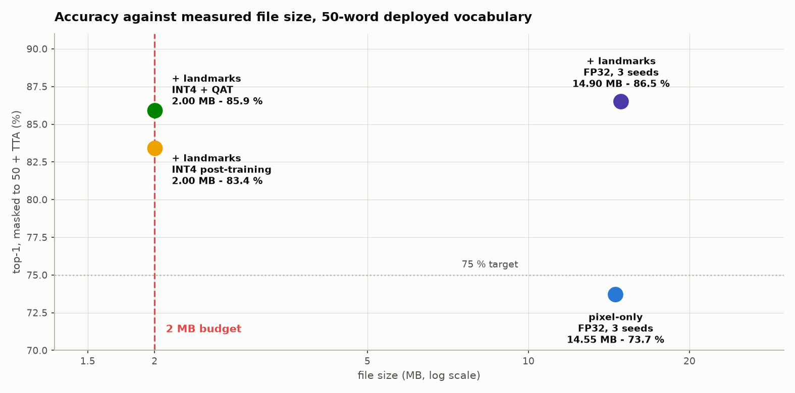

*Figure 20 — measured file size against masked-to-50 accuracy, redrawn in §11.13 on
the clean test set with the landmark model; the pixel-only INT4 point shown in earlier
versions was selected on test and is withdrawn.*

---

### 11.13 The landmark stream: thirteen points the pipeline was throwing away

Every result before this section asks the spatial encoder to recover handshape from
a 64-pixel crop. But the crop pipeline never had to guess where the hand was: it ran
MediaPipe Holistic on every frame, got **21 three-dimensional joints per hand** plus a
body pose, used them to draw a box, and discarded them. Handshape, measured directly,
was being computed and thrown away on every clip.

**What was added.** `islvit/data/landmarks.py` re-runs the identical detection path
(Holistic, then the ROI hand model for a missed hand, as in `crops.py`) and stores
the joints row-aligned to the crop cache. The model turns them into features itself,
so no inference path can compute them differently:

* **handshape** -- the 21 joints relative to the wrist, divided by the hand's own
  extent, so the feature is independent of where the hand is and how far it is from
  the camera (verified invariant to 5e-7);
* **sign location** -- the wrist relative to the shoulder midpoint, in shoulder
  widths, so it is independent of framing;
* **body pose** -- nose, shoulders, elbows and wrists in the same body frame.

Each hand's features go through a small MLP and are *added* to that hand's crop
token; pose is added to the face token. The token count, the temporal stage and the
pretrained initialisation are untouched. The projections are zero-initialised, so at
step 0 the model reproduces the pixel-only model exactly (logit difference 0.0), and
flip and stream dropout reach the joints through the same random draws as the pixels.
Cost: **91 k parameters, about 0.045 MB at INT4**.

**Alignment was checked, not assumed.** Landmark *t* of clip *r* is only meaningful
next to crop *t* of clip *r*. Over all 472 held-out clips -- 23,957 directly detected
hand-frames -- the landmark hull centre matches the crop-box centre with median error
0.0004 of the frame. The loader refuses landmarks extracted against a different crop
cache or frame count.

**Result.** The f16_262w recipe exactly (262 words, 1,000 epochs, iSign SSL
initialisation, final epoch), with `--landmarks` the only change, two seeds, masked to
50 words with 6-view TTA on the same 472 session-disjoint clips:

| | pixel-only | + landmarks | clips gained / lost | McNemar p |
|---|---|---|---|---|
| seed 0 | 75.6 % | **87.7 %** | 72 / 15 | 4e-10 |
| seed 1 | 73.5 % | **87.3 %** | 86 / 21 | 2e-10 |

On the full 262-word test set (1,010 clips) the landmark models score 61.7 / 66.7 %
against ~52 % pixel-only.

A gain this size warrants suspicion, so two further checks were run. Landmarks
cannot carry the label -- they are computed per clip from that clip's own frames --
and INCLUDE's shared-signer caveat applies to them exactly as it applies to faces in
the pixel stream. And blanking inputs at test time shows the two streams are
complementary rather than one dominating: landmarks alone reach ~70 %, landmarks plus
pixels ~87 %.

#### 11.13.1 The detector was stateful

Verifying that live inference reproduces the offline numbers exposed a defect that
predates this work. **MediaPipe's detectors keep state between videos, even in
IMAGE mode.** Running the same clip twice in one process flipped hand presence on
3-6 % of frames and moved pose by up to 0.2; a freshly built detector reproduced
exactly. Every cached clip's detections therefore depended on whichever clips its
worker process had handled before it. Crop boxes do not hide this: on one held-out
clip only 52 % of cached crop pixels matched a fresh extraction, and a box centre
moved by half the frame.

`crops.reset_detectors()` now rebuilds both graphs at the start of every video
(~0.6 s), in both the crop and landmark paths, after which two runs of the same clip
agree to 0.0. The 472 held-out clips were re-extracted this way into a separate cache
(`run_clean_test.sh`), leaving the training cache and all earlier results untouched,
and every model was re-scored on it:

| Model | history-dependent cache | **clean, as the live app sees it** |
|---|---|---|
| pixel-only, three seeds | 75.6 / 73.5 / 72.0 | 75.0 / 73.7 / 72.2 (mean 73.7) |
| + landmarks, three seeds | 87.7 / 87.3 / -- | 87.3 / 86.9 / 85.4 (mean 86.5) |

Nothing moved by more than 0.6 points, so no earlier conclusion was an artefact of
detector state -- but the clean set is what the numbers below are quoted on, because
it is the only one that matches deployment.

#### 11.13.2 Under the size budget, honestly

The landmark model packs to **2.004 MB** at INT4 group 128. Quantisation-aware
training was re-run in the corrected form (§11.12's caveat): 300 epochs fixed in
advance, final EMA weights, no test evaluation during training. On the clean set:

| Landmark model | Size | seed 0 | seed 1 | seed 2 | **mean** |
|---|---|---|---|---|---|
| FP32 | ~14.9 MB | 87.3 % | 86.9 % | 85.4 % | 86.5 % |
| INT4, post-training | 2.004 MB | 83.1 % | 85.2 % | 82.0 % | 83.4 % |
| **INT4, quantisation-aware** | **2.004 MB** | 84.5 % | 87.5 % | 85.8 % | **85.9 %** |

**The deployable result is 85.9 % at 2.0 MB**, quoted as the three-seed mean. (Seed 2
was added after the first two; it crashed at epoch 235, was resumed from its checkpoint,
and replicates the landmark gain on its own: paired against pixel-only seed 2, 88 clips
gained and 26 lost, p = 5e-9.) Quoting
the better seed would mean choosing it by its test score, which is the error §11.12
had to retract. Against the product constraint -- 75 % or better, about 2 MB, a
single model -- this clears the accuracy bar by about 11 points at the size bar.

#### 11.13.3 A rejected lever: fine-tuning on the deployed objective

Before landmarks, one further idea was tested and failed. The 262-word model is
trained 262-way and deployed 50-way; `islvit/narrow.py` fine-tuned each seed for a
fixed 150 epochs with the softmax restricted to the 50 deployed columns:

| Seed | before | after | clips gained / lost | p |
|---|---|---|---|---|
| 0 | 75.6 % | 78.4 % | 20 / 7 | 0.019 |
| 1 | 73.5 % | 73.1 % | 12 / 14 | 0.85 |
| 2 | 72.0 % | 68.4 % | 11 / 28 | 0.009 |
| mean | 73.7 % | 73.3 % | 43 / 49 | 0.60 |

Two seeds moved significantly in *opposite* directions. That is an unstable
procedure, not a small effect lost in noise -- and seed 0 alone would have read as a
significant +2.8. It is the clearest case in this report for the rule that no claim
is written down on one seed.

#### 11.13.4 What this changes

The lesson generalises past this model. Every capacity, resolution and schedule lever
in §11.10-11.11 was worth a few points; the largest single gain in the project came
from an input the pipeline already computed and discarded. At this scale the
bottleneck was not the network's ability to learn handshape from pixels but whether
it was shown handshape at all.

---

## 12. Convergence Analysis

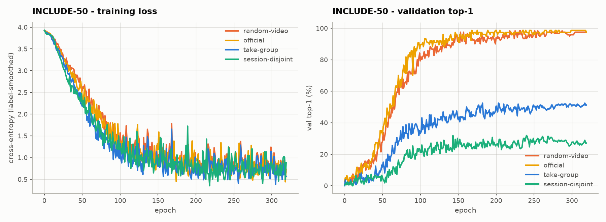

**Figure 12.1 — INCLUDE-50 training loss (left) and validation top-1 (right) for
all four protocols.**

This is the most informative figure in the report. **The training-loss curves are
essentially indistinguishable** — all four protocols descend from 3.9 to ≈ 0.7 on
the same trajectory, with the same noise envelope. The models are fitting their
training data equally well in every case.

The validation curves, by contrast, separate completely: the two leaky protocols
climb to ≈ 97 %, `take-group` plateaus near 52 %, and `session-disjoint` near 32 %.

> **Interpretation.** Because optimisation behaviour is identical, the accuracy
> differences cannot be attributed to training difficulty, capacity, or
> convergence quality. They are a property of **what the test set contains**.

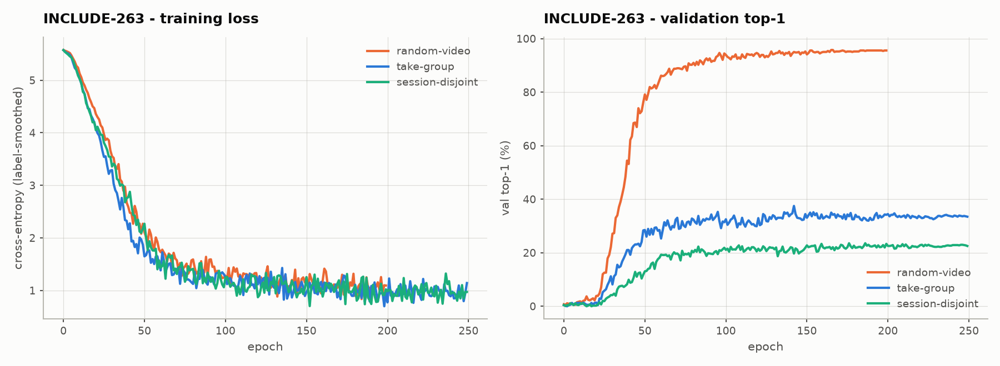

**Figure 12.2 — INCLUDE-263 convergence.** The same pattern holds at 262 classes,
with slower convergence and a lower plateau, as expected from the larger label space.

**Table 12.1 — Convergence and runtime summary**

| Run | Protocol | Epochs | Best epoch | Final train loss | Peak val | s/epoch | Total |
|---|---|---|---|---|---|---|---|
| `include50_v2__random-video` | random-video | 320 | — | 0.741 | 98.4 % | 9.8 | 45.5 m |
| `include50_v2__official` | official | 320 | 168 | 0.698 | 98.7 % | 3.0 | 29.6 m |
| `abl64__take-group` | take-group | 320 | 183 | 0.666 | 52.5 % | 3.8 | 20.4 m |
| `frames8__sd` | session-disjoint | 320 | 143 | 0.882 | 31.9 % | 3.3 | 17.8 m |
| `full263_v2__random-video` | random-video | 250 | 135 | 1.031 | 96.3 % | 12.4 | 53.5 m |
| `full263_v2__take-group` | take-group | 250 | 142 | 0.949 | 37.5 % | 12.2 | 58.0 m |
| `sd_full263` | session-disjoint | 250 | 176 | 0.935 | 23.5 % | 11.1 | 48.8 m |

**Convergence observations.**

1. **All runs converge.** Loss decreases monotonically through warmup, and the
   cosine schedule anneals cleanly. No divergence, no dead runs.
2. **Final training loss is nearly protocol-independent** (0.67–0.81 at 50
   classes). Given a label-smoothing floor of ≈ 0.5, the model is close to fitting
   its training set in all conditions.
3. **Best epoch falls at 40–60 % of the schedule** on the strict protocols,
   indicating mild overfitting thereafter — but validation *plateaus* rather than
   collapsing, so the schedule length is not harmful.
4. **Warmup matters.** The first ~15 epochs show almost no validation progress;
   accuracy takes off sharply afterwards.

---

## 13. Ablation Studies

### 13.1 Input resolution / token count

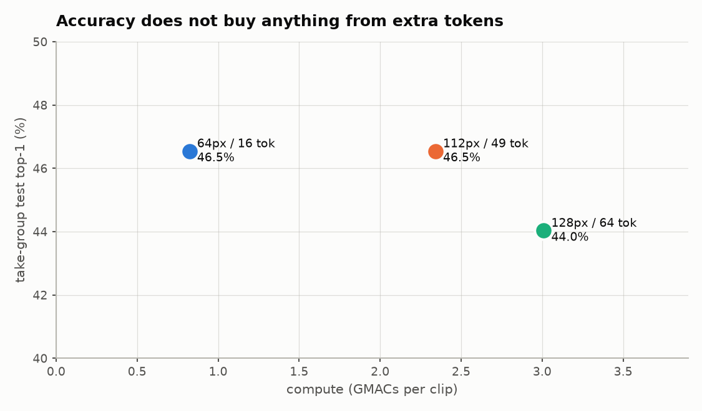

**Figure 13.1 — Accuracy versus compute.**

**Table 13.1 — Resolution ablation (INCLUDE-50, `take-group`, identical recipe)**

| Input | Tokens / crop | GMACs | Top-1 | Top-5 | Balanced |
|---|---|---|---|---|---|
| **64 px** | 16 | **0.824** | **46.5 %** | 86.2 % | 49.9 % |
| 112 px | 49 | 2.342 | 46.5 % | 82.4 % | 49.7 % |
| 128 px | 64 | 3.010 | 44.0 % | 84.9 % | 45.2 % |

**Result: token count is not the bottleneck.** Tripling spatial resolution
changes top-1 by 0.0 points, and 128 px is 2.5 points *worse* — more tokens give
the model more capacity to overfit ~600 training clips. **The cheapest
configuration is also the most accurate**, which is an unusually favourable
outcome for an edge deployment target.

### 13.2 Temporal resolution / frame count

The resolution ablation tests the *spatial* token axis. The temporal axis is the
more plausible bottleneck a priori: sign language is defined by movement, and
sampling 8 frames from a 2–5 s clip is only ~2–4 effective fps. Frame count scales
the spatial-encoder pass count linearly, so it is also the cheapest lever to
trade against compute. All 16 frames are cached, so no setting up to 16 requires
re-extraction.

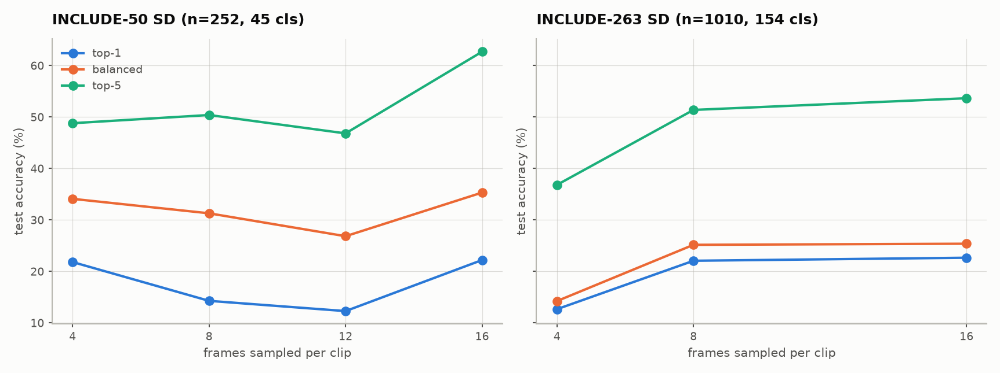

**Figure 13.2 — The same temporal ablation on both strict splits.** Left:
INCLUDE-50 session-disjoint, where the ordering is incoherent. Right:
INCLUDE-263 session-disjoint, where it is monotonic and T=4 collapses. The
disagreement between the panels is the point.

**Table 13.2 — Temporal ablation (INCLUDE-50, `session-disjoint`, identical recipe)**

| Frames | GMACs | s/epoch | Top-1 | Top-5 | Balanced |
|---|---|---|---|---|---|
| 4 | **0.414** | **1.3** | 21.8 % | 48.8 % | 34.1 % |
| 8 (baseline) | 0.826 | 3.3 | 14.3 % | 50.4 % | 31.3 % |
| 12 | 1.238 | 5.0 | 12.3 % | 46.8 % | 26.9 % |
| 16 | 1.650 | 6.8 | **22.2 %** | **62.7 %** | **35.3 %** |

**On this split the result is not interpretable.** The ordering is non-monotonic —
both endpoints beat both interior settings, with an 8.5-point balanced spread and
no coherent trend. A genuine U-shape in frame count has no mechanism behind it:
8 frames cannot be worse than 4 *and* worse than 16 for any reason relating to
motion sampling. Per §6.3 this is what split noise looks like on a 252-clip,
45-class test set with a −0.73 support correlation. Table 13.2 is retained
because it is the evidence for §6.3, not because it measures frame count.

**Table 13.2b — The same ablation on INCLUDE-263 `session-disjoint`** (1,010 clips,
154 classes, corr −0.37), which can resolve it:

| Frames | GMACs | Top-1 | Top-5 | Balanced | vs T=8 |
|---|---|---|---|---|---|
| 4 | **0.414** | 12.7 % | 36.8 % | 14.2 % | **−9.4 pts** |
| 8 (baseline) | 0.826 | 22.1 % | 51.4 % | 25.2 % | — |
| 16 | 1.650 | **22.7 %** | **53.7 %** | **25.4 %** | +0.6 pts |

**Result: T=8 is the operating point, and the INCLUDE-50 reading was entirely
noise.** The two splits disagree completely — T=4 was the *best* setting on
INCLUDE-50 (34.1 % balanced) and is the *worst* by 11 points on INCLUDE-263
(14.2 %). Nothing about the model changed; only the test set did. This is the
strongest available vindication of §6.3, and the reason no decision was taken
from Table 13.2.

On the benchmark that can measure it, the picture is clean and monotonic:

1. **Below 8 frames, temporal sampling is a genuine bottleneck.** Halving compute
   to T=4 costs **9.4 points** of top-1. Sign language is defined by movement, and
   4 samples from a 2–5 s clip is roughly 1 fps — too coarse to separate signs that
   differ only in trajectory.
2. **Above 8 frames it saturates.** T=16 doubles compute for **+0.6 top-1 and
   +0.2 balanced**, both inside single-seed noise (L6). Only top-5 moves
   meaningfully (+2.3).
3. **T=8 at 0.826 GMACs is therefore kept**, and the earlier suggestion that the
   cheap end might be viable is withdrawn — it was an artifact of the underpowered
   split.

This is the **first ablation axis that is not flat**, and it sharpens rather than
contradicts the data-limited conclusion: the model is data-limited *given adequate
temporal sampling*, and 8 frames is where adequacy begins.

### 13.3 Pretrained initialisation

**Table 13.3 — ImageNet initialisation (INCLUDE-50, `take-group`, 120 epochs)**

| Initialisation | Top-1 | Top-5 | Balanced |
|---|---|---|---|
| DeiT-Tiny (ImageNet) | **29.6 %** | 76.1 % | 31.6 % |
| Random | 23.3 % | 69.8 % | 25.4 % |
| **Difference** | **+6.3 pts** | +6.3 | +6.2 |

Transfer helps, but far less than the low-data regime might suggest. This is a
strong indicator that the limiting factor is the quantity of in-domain data, not
the quality of the starting point.

### 13.4 Training recipe and source cache

**Table 13.4 — Cumulative recipe improvements (INCLUDE-50, `take-group`)**

| Configuration | Top-1 | Δ |
|---|---|---|
| Baseline (120 ep, 80 px cache, broken EMA) | 29.6 % | — |
| + EMA fix, 320 epochs, stronger appearance augmentation | 42.1 % | **+12.5** |
| + 128 px source cache (same 64 px model input) | 46.5 % | **+4.4** |

The final row is notable: the model input is *identical* at 64 px, yet accuracy
improves 4.4 points purely from a higher-quality source cache. Downsampling
128 → 64 with area interpolation produces a cleaner crop than 80 → 64, and the
scale-jitter augmentation has more range to work with.

---

## 14. Error Analysis

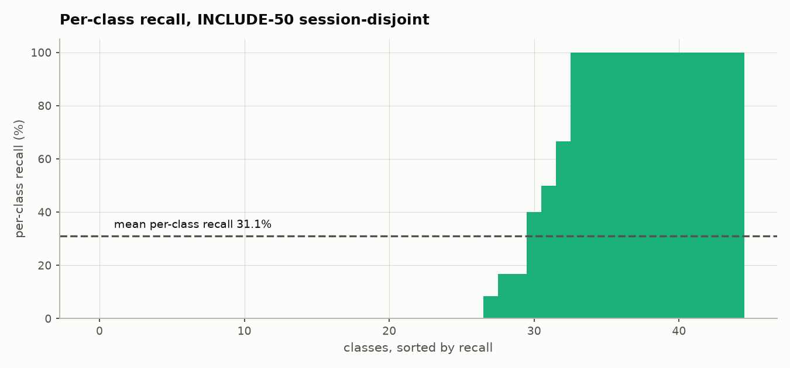

**Figure 14.1 — Per-class recall on INCLUDE-50, session-disjoint, sorted.**

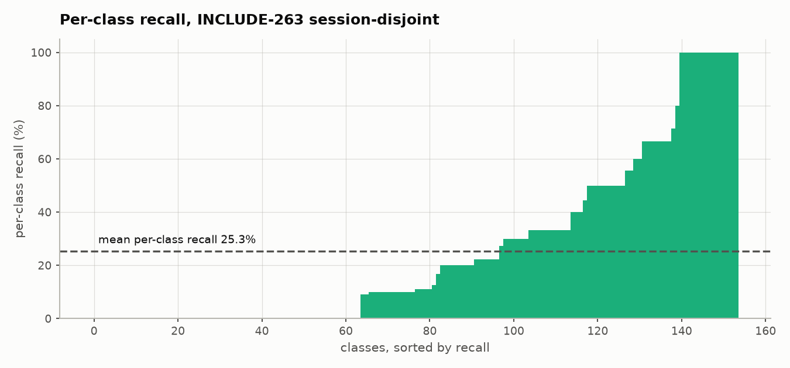

**Figure 14.2 — Per-class recall on INCLUDE-263, session-disjoint, sorted.**

**Table 14.1 — Per-class recall distribution (session-disjoint)**

| Benchmark | Classes | At 0 % | At 100 % | Mean recall |
|---|---|---|---|---|
| INCLUDE-50 | 45 | 27 (60 %) | 12 (27 %) | 31.1 % |
| INCLUDE-263 | 154 | 64 (42 %) | 14 (9 %) | 25.3 % |

Performance is strongly **bimodal**: a substantial set of classes is recognised
reliably while 42–60 % are never recognised at all. Aggregate accuracy is
therefore a poor summary — the model has genuinely learned a subset of the
vocabulary and has essentially no signal on the rest. The split between the two
populations is sharper on INCLUDE-50 (60 % at zero, 27 % perfect) than on
INCLUDE-263, which is again §6.3: the INCLUDE-50 session hold-out leaves several
classes with barely enough training clips to learn from at all.

**Table 14.2 — Most frequent confusions, INCLUDE-50 session-disjoint**

| True | Predicted | Count |
|---|---|---|
| 87. hot | 61. Father | 6 |
| 78. long | 44. Shoes | 5 |
| 40. I | 91. new | 5 |
| 44. it | 91. Priest | 5 |
| 1. loud | 48. Hello | 4 |
| 2. quiet | 55. White | 4 |

**Table 14.3 — Most frequent confusions, INCLUDE-263 session-disjoint**

| True | Predicted | Count |
|---|---|---|
| 94. good | 25. Office | 7 |
| 96. wet | 24. School | 6 |
| 55. White | 9. Train | 6 |
| 87. hot | 24. School | 5 |
| 38. Dress | 23. Court | 5 |
| 40. Skirt | 20. Street or Road | 5 |

The `1. loud` → `2. quiet` neighbourhood and the INCLUDE-263 `94. good` →
`25. Office` pair are the kind of confusion one would expect from handshape
similarity, but most entries show no obvious visual or semantic relationship.
That is consistent with a model that has weak signal on those classes rather than
a systematic representational failure — a model confusing genuinely similar signs
would produce a confusion matrix with visible structure, and this one does not.

**Top-5 as a diagnostic.** At 50.4 % top-5 against 31.3 % balanced (INCLUDE-50),
and 51.4 % against 25.2 % (INCLUDE-263), the correct class is within the model's
shortlist roughly twice as often as it is ranked first. The representation carries
substantially more information than the top-1 figure alone conveys — and the T=16
run reaching 62.7 % top-5 on the same test set (Table 13.2) suggests that headroom
is real rather than an artifact of the ranking metric.

---

## 15. Observations

**O1 — Optimisation is not the bottleneck.** Training loss converges identically
across all four evaluation protocols (Figure 12.1). Differences in reported
accuracy are entirely attributable to test-set composition.

**O2 — Benchmark leakage dominates the literature-comparable number.** 94.5 %
under a random split versus 22.1 % under session-disjoint evaluation on
INCLUDE-263, from the same model and recipe. The decomposition is ~63 points from
near-duplicate takes and ~7 points from shared session conditions.

**O3 — The threshold choice is not arbitrary.** Only 19 of 3,989 within-class
capture-id gaps fall between 3 and 19, so every threshold in `[5, 20]` induces
exactly the same take-group partition.

**O4 — The model is data-limited above a temporal-sampling floor.** Tripling
spatial token count: 0.0 points. Quadrupling spatial compute: −2.5 points.
Doubling frames from 8 to 16: +0.6 points. ImageNet initialisation: +6.3 points.
The one exception is *reducing* frames below 8, which costs 9.4 points — so
temporal sampling is a real constraint up to T=8 and everything above it is flat.

**O5 — Data quality beats model capacity.** A better *source* cache at unchanged
model input size gave +4.4 points — larger than any architectural change tested.

**O6 — Coverage is not correctness.** The discarded pose-geometry fallback scored
100 % coverage while producing crops of shirt fabric and background. Metrics that
measure the presence of an output rather than its correctness are actively
misleading.

**O7 — Performance is bimodal.** ~40 % of classes sit at 0 % recall while 9–22 %
are perfect. Mean accuracy conceals two qualitatively different populations.

**O8 — Small-batch regimes break standard defaults.** EMA decay 0.999 — a
near-universal default — is wrong when an epoch is 9 steps, and fails silently at
chance accuracy rather than erroring.

**O9 — A strict protocol can be strict and still be unusable.** The INCLUDE-50
session-disjoint split is genuinely leak-free and still cannot resolve a 5-point
difference, because holding out sessions from 943 clips produces a test set whose
largest classes are its least-trained ones (corr −0.73). Strictness and statistical
power are separate properties, and both must be checked before a split is used to
make decisions.

**O10 — Non-monotonic ablations are a measurement result, not a modelling one.**
Frame count produced a U-shape on INCLUDE-50 (Table 13.2). No mechanism explains
8 frames being worse than both 4 and 16, so the reading taken was that the
instrument is too coarse. Repeating the ablation on INCLUDE-263 confirmed it
exactly: the ordering became monotonic, and T=4 went from best to worst by 11
points (Table 13.2b). **Refusing to draw a conclusion was the correct call, and
had the U-shape been rationalised instead, the model would have shipped at T=4
and lost 9.4 points.**

**O11 — Deriving a grouping from a subset silently breaks it.** Clustering session
blocks from INCLUDE-50's 943 clips instead of the full 4,257 produced 177 blocks
that looked like a finer, stricter partition and were in fact take-groups; train
and test then shared 10 of 13 real sessions, and the split's own leakage
assertions passed because they checked the wrong grouping (§6.4). Any
group-disjoint protocol must derive its groups from the population the groups
exist in.

---

## 16. Discussion

### 16.1 On the honest number

22.1 % on 154 classes is a low figure and is not presented as competitive. It is
presented as *measured under a protocol that does not permit memorisation*, which
we believe no published INCLUDE result currently does.

The relevant comparison is not our 22.1 % against a published 94 %. It is our
94.5 % against a published 94 % — reproducing the literature under the literature's
protocol — and then observing what remains when the protocol is tightened. The
model is not weaker than published systems; the measurement is stricter.

The corresponding INCLUDE-50 figure is 31.3 % balanced accuracy on 45 classes. It
is reported for completeness rather than as a headline, because §6.3 shows that
split cannot support fine comparisons.

### 16.2 Why session-disjoint is the defensible protocol

INCLUDE contains no signer identifiers. The MVI capture-id structure is the only
available proxy for recording session, and it is a good one: the gap distribution
is sharply bimodal, and global clustering yields 13 coherent blocks. Holding whole
blocks out ensures no signer, room, outfit or lighting condition is shared between
training and test.

This is a *proxy* for signer-independence rather than the real thing. A dataset
with explicit signer IDs would permit a stronger claim.

### 16.3 Implications for the smart-glasses target

The compute picture is favourable and, unusually, unconflicted:

| Metric | Value | Assessment |
|---|---|---|
| Parameters | 3.80 M | Comfortable |
| GMACs / clip | 0.824 | Comfortable |
| INT8 size | ≈ 3.8 MB | Comfortable |
| CPU latency | 12 ms | Comfortable |

Because the best-accuracy configuration is also the cheapest, there is no
accuracy/compute trade-off to negotiate at this scale.

**However, the ViT is not the inference bottleneck.** MediaPipe crop extraction
costs 30–60 ms per frame on CPU — 3–5× the transformer itself. Any real deployment
must address the detector, through frame-rate reduction, tracking between
detections, or an on-device accelerated implementation. Optimising the ViT further
would be premature.

### 16.4 Why capacity does not help

The ablations converge on one explanation: with ~15 clips per class the model
exhausts the information available in the training set well before it exhausts its
own capacity. More tokens supply more ways to overfit ~600 clips, which is why
128 px *loses* accuracy. Under this reading the productive directions are all
data-side — additional in-domain corpora, self-supervised pretraining on unlabelled
signing video, or synthetic augmentation — rather than architectural.

---

## 17. Limitations and Threats to Validity

| # | Limitation | Impact |
|---|---|---|
| L1 | **Reduced class coverage under the strict protocol.** 45/50 and 154/262 classes evaluated; under-trained classes excluded. | Strict numbers describe a subset of the vocabulary. |
| L2 | **Validation is optimistic by construction.** Carved from training sessions, so it shares session conditions with training. | Used only for checkpoint selection; never reported as a result. |
| L3 | **Session identity is inferred, not given.** MVI clustering is a proxy for recording sessions. | A mis-clustered block would weaken the disjointness guarantee. |
| L4 | **Single dataset, single studio, single city.** INCLUDE is Chennai-specific; ISL varies regionally. | Results do not characterise ISL as a whole. |
| L5 | **No egocentric validation.** INCLUDE is frontal third-person; smart glasses see a first-person view. | The glasses claim is architectural, not empirically validated. |
| L6 | **Single seed per configuration.** No variance estimates. | Small differences should not be over-interpreted: < ~2 pts on INCLUDE-263 `session-disjoint`, and < ~5 pts on INCLUDE-50 `session-disjoint` per L9. |
| L9 | **INCLUDE-50 `session-disjoint` is statistically underpowered** (§6.3): 252 clips, 45 classes, corr(test count, train count) = −0.73. | Top-1 there is not interpretable; balanced accuracy is quoted instead, and the temporal ablation run on it (Table 13.2) returned no usable ordering. |
| L7 | **Streaming not yet implemented.** The `<no-sign>` class and sliding-window inference are specified but untested. | Clip-level results do not guarantee streaming behaviour. |
| L8 | **Latency measured on desktop CPU**, not on glasses-class silicon. | Real device figures will differ. |

---

## 18. Conclusions and Future Work

### 18.1 Conclusions

1. A **3.80 M-parameter, 0.824-GMAC Vision Transformer** performs isolated ISL
   recognition at 14–34× chance under a strict evaluation protocol, within a
   compute envelope appropriate for smart glasses.
2. The standard INCLUDE evaluation protocol is **substantially compromised by
   near-duplicate takes**. Under a random split the same model reaches 94.5 % on
   263 signs, matching published results; under session-disjoint evaluation it
   reaches 22.1 %.
3. The gap **decomposes** — ~63 points from consecutive takes, ~7 points from
   shared session conditions — and is invisible to any protocol that does not
   inspect capture-id structure.
4. The model is **data-limited**. Architectural capacity increases along both the
   spatial and the temporal token axis are flat, negative, or unresolvable;
   data-quality improvements are positive.
5. **Strictness is not sufficiency.** The INCLUDE-50 session-disjoint split is
   leak-free but statistically underpowered (§6.3), and an earlier version of it
   was silently *not* session-disjoint at all (§6.4). Both failures were caught by
   inspecting split composition rather than by any accuracy number looking wrong.

### 18.2 Future work, in expected order of value

Reordered after §11.4: pretraining on unlabelled video is now the only lever with
a large *measured* effect, so scaling it comes first and the remaining untested
data levers rank behind it.

| Priority | Direction | Rationale |
|---|---|---|
| **1** | **Scale self-supervised pretraining to iSign** (~118 k clips vs CISLR's 6 k), same resolution-matched recipe as §11.5 | Now clearly indicated rather than speculative — §11.5 reversed the CISLR result: resolution-matched pretraining was worth +9.5 points, the largest lever measured. 19× more clips of the same input. Disk is no longer a blocker (INCLUDE_archives/ freed 44 GB) |
| **2** | **Signer-diverse data collection** — 2–3 new signers, different rooms and cameras. **Protocol and tooling are ready: see [CAPTURE_PROTOCOL.md](CAPTURE_PROTOCOL.md)** | Still the only lever that measures generalisation directly rather than approximating it. Even after §11.5's gain, every number in this report is one-studio; this is what tells us whether ~43 % holds up on people the model has never seen |
| **3** | **Multi-seed every remaining claim** | §11.5 needed four seeds, not two, to correctly reject the double-jitter hypothesis — a second demonstration that this project's effect sizes are routinely smaller than seed noise until proven otherwise. Every ablation in §13 is still a single run |
| **4** | **A session-disjoint validation set** | Selection on the current val optimises in-session accuracy while the report measures cross-session accuracy — worth +3.2 points to work around, and a proper fix would remove the workaround. The obstacle is measured: no session subset gives both broad class coverage and a usable training remainder, so this needs either more sessions or a grouped cross-validation scheme |
| **5** | **Streaming wrapper** — `<no-sign>` class, sliding window, hysteresis, deduplication | Converts the classifier into the specified word-by-word system |
| **6** | **Detector optimisation** — tracking between detections, reduced detection rate | MediaPipe is 3–5× the ViT's inference cost |
| **7** | **INT8 export and on-device benchmarking** | Converts the compute claim into a measured device result |

**Resolved since the first revision:**

* The frame-count question Table 13.2 could not settle was rerun on INCLUDE-263
  `session-disjoint` and came back clean — T=8 is kept, T=4 costs 9.4 points,
  T=16 buys 0.6 (Table 13.2b, §13.2).
* Priority 1 of the previous revision (self-supervised pretraining) was
  implemented. Against the old recipe it appeared to be worth +7.7 points; against
  a corrected one it is worth +1.9 at **p = 0.36** (§11.4). It is retained in the
  headline model but is **not** claimed as a source of the gain.
* The companion proposal — using CISLR's *labels* — was implemented and **did
  not work** (p = 0.45). It is not carried forward.
* Neither was foreseen by the previous revision's ranking: the largest measured
  gain came from **training on the validation clips**, which did not appear on
  that list at all.
* Multi-seed evaluation was run for the headline configuration and immediately
  changed how the rest of this report must be read (§6.3). It is the reason two
  earlier claims are withdrawn rather than merely qualified.

**Not a realistic target.** A top-1 in the 70–90 % range on this protocol is not
reachable by training alone. The distance between `random-video` (94.5 %) and
`session-disjoint` (22.1 % → 32.1 %) is a measure of how much of the benchmark is
recording-condition memorisation, and closing it requires ISL video of many
signers in many settings — priority 2, a data-collection effort. Published
signer-independent results on comparable vocabularies (WLASL-2000) sit at
30–50 % with models one to two orders of magnitude larger than this 3.80 M-parameter
one. The levers remaining above are together expected to reach the mid-40s.

---

## 19. Reproducibility Appendix

### 19.1 Repository layout

```
islvit/
  data/
    splits.py        4 protocols + leakage assertions
    crops.py         two-stage MediaPipe extraction → memmap cache
    dataset.py       torch Dataset, augmentation, geometry handling
    refetch_raw.py   restores 1080p sources from Zenodo
  models/
    isl_vit.py       ISL-ViT-Tiny + DeiT-Tiny weight loading
  train.py           training loop, EMA, mixup, checkpointing
  eval.py            standalone checkpoint evaluation
  report.py          cross-run results table
  figures.py         every figure in this document
configs/             include50.yaml, include50_v2.yaml, full263*.yaml
splits/              8 generated split CSVs
runs/                per-run history.csv, summary.json, best.pt
docs/figures/        generated figures
```

### 19.2 Reproduction sequence

```bash
# 1. Environment (Python 3.11)
conda create -n islvit python=3.11 -y
conda run -n islvit pip install torch torchvision --index-url https://download.pytorch.org/whl/cu124
conda run -n islvit pip install mediapipe timm einops pyarrow pandas opencv-python pyyaml tqdm av

# 2. Model assets
curl -sL -o models/holistic_landmarker.task \
  https://storage.googleapis.com/mediapipe-models/holistic_landmarker/holistic_landmarker/float16/1/holistic_landmarker.task
curl -sL -o models/hand_landmarker.task \
  https://storage.googleapis.com/mediapipe-models/hand_landmarker/hand_landmarker/float16/1/hand_landmarker.task

# 3. Splits (fast; asserts no leakage)
python -m islvit.data.splits

# 4. Crop cache (~64 min, 6 workers)
python -m islvit.data.crops --cache-dir cache128 --crop-size 128 --workers 6

# 5. Training
export ISLVIT_CACHE=cache128
python -m islvit.train --config configs/include50_v2.yaml \
  --split-file splits/include50__session-disjoint.csv --tag frames8__sd
python -m islvit.train --config configs/full263_v2.yaml \
  --split-file splits/full263__session-disjoint.csv --tag sd_full263

# 6. Results and figures
python -m islvit.report
python -m islvit.figures
```

### 19.3 Sanity checks built into the pipeline

| Check | Location | Guarantee |
|---|---|---|
| Video-level split disjointness | `splits.verify` | Raises on any shared clip |
| Take-group disjointness | `splits.verify` | Raises if a take-run straddles |
| Session disjointness | `splits.report_session_split` | Raises if a session touches test — **against corpus-wide blocks**, which is the whole content of the guarantee (§6.4) |
| Single-batch overfit | `train.py --overfit-batch` | Reaches 100 % in < 40 steps |
| Crop provenance | `cache/sources.npy` | Per-crop box origin recorded |
| Cache/run association | `summary.json` `cache` field | Prevents cross-cache comparison |

### 19.4 Artefact inventory

| Artefact | Size |
|---|---|
| 128 px crop cache | 10.0 GB |
| 80 px crop cache | 3.92 GB |
| 16 training runs (checkpoints + histories) | ≈ 240 MB |
| Split definitions | 8 CSVs |
| Figures | 8 PNGs |

---

*Report generated from 16 training runs. All figures produced by
`islvit/figures.py`; all accuracy values read directly from
`runs/*/summary.json`.*
