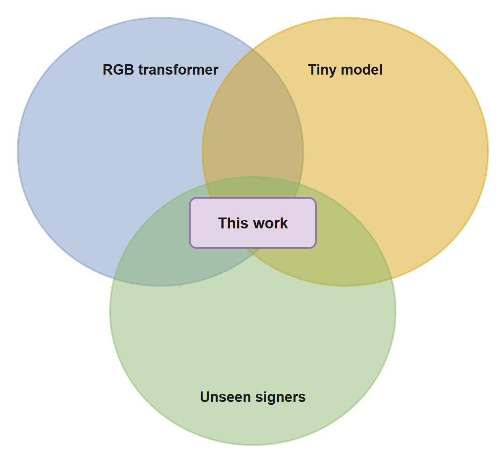
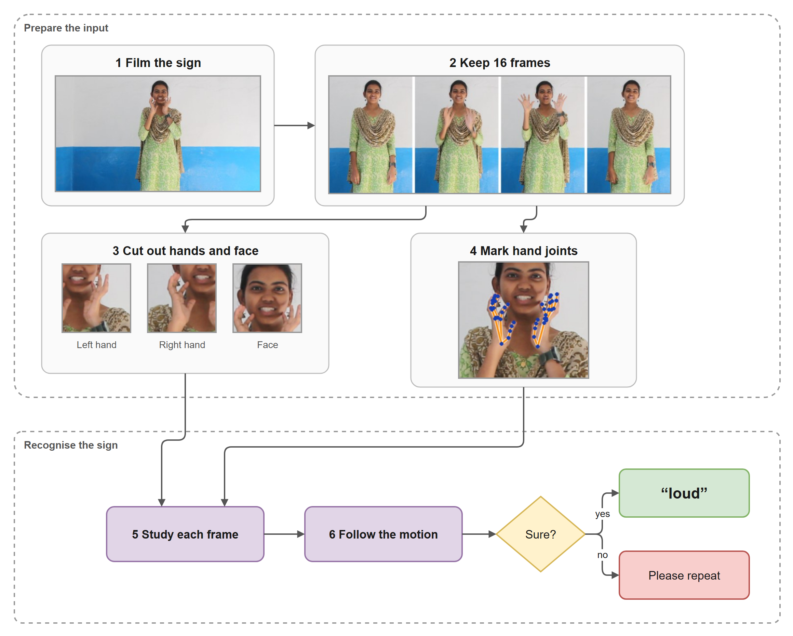
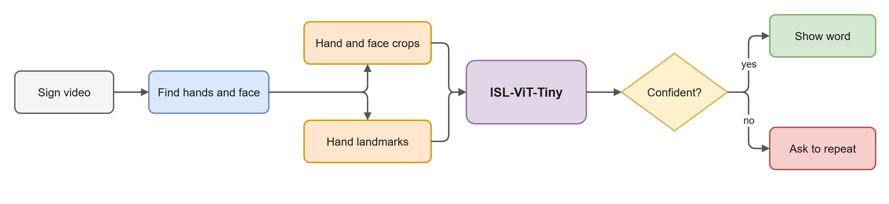
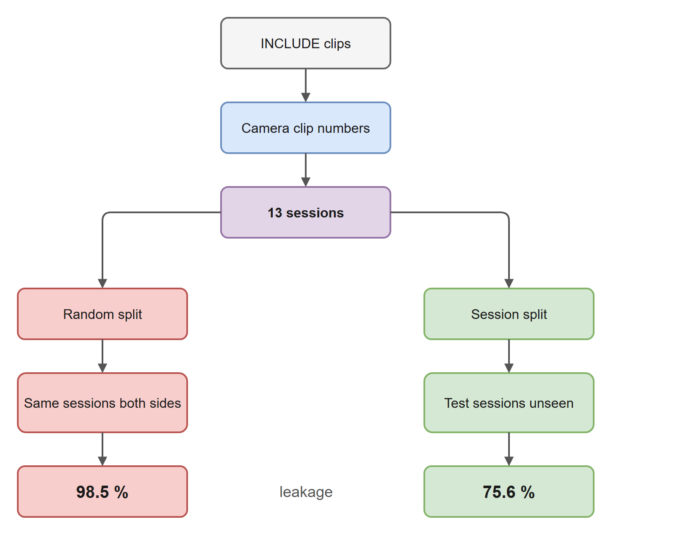
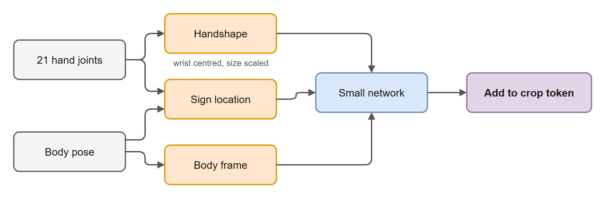
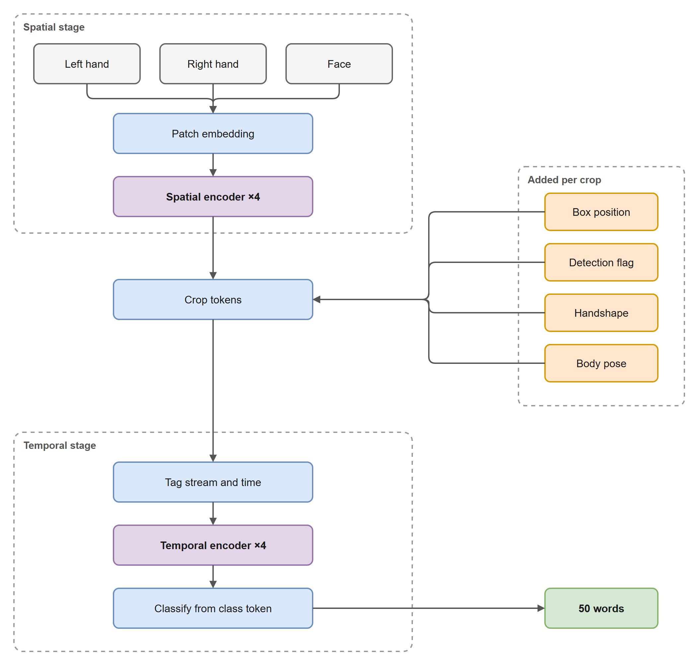
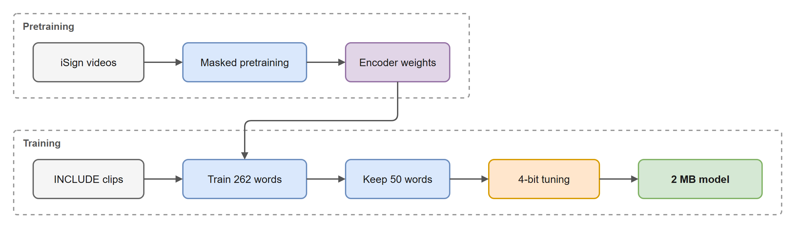
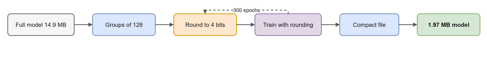
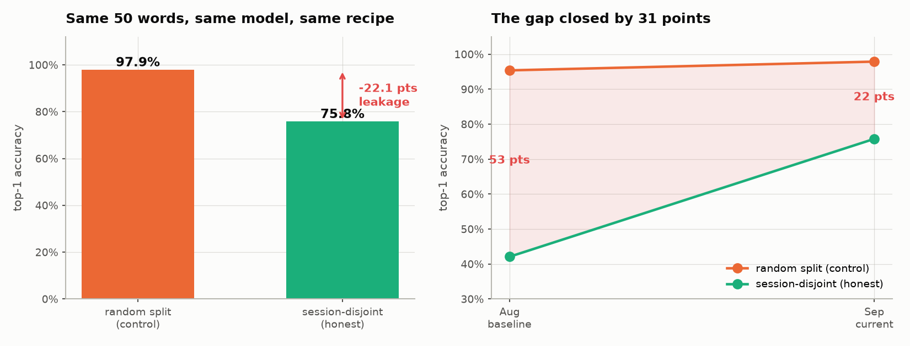
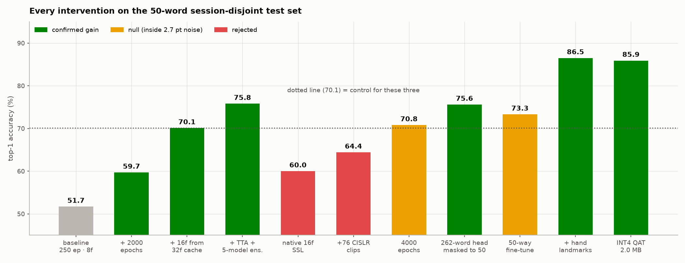

::: {.authors custom-style="Authors"}
Yalamanchi Kushal^1^ (CB.SC.U4CSE23766) · Nethi Kushala Kumar^1^ (CB.SC.U4CSE23735) · Dhruseek Rishi Menon^1^ (CB.SC.U4CSE23716)
:::

::: {.affiliation custom-style="Affiliation"}
^1^Department of Computer Science and Engineering, Amrita School of Computing, Amrita Vishwa Vidyapeetham, Coimbatore, India\
Faculty guide: Dr. T. Bagyammal
:::

# Abstract {.unnumbered}

Published Indian Sign Language (ISL) recognisers report accuracies above 94 %, but most are measured on random splits, where clips recorded in the same session fall on both sides of the train–test boundary. We present ISL-ViT-Tiny, a factorised video Vision Transformer that reads three cropped streams per frame (left hand, right hand, face) together with the hand landmarks its detector already computes, and we test it only on recording sessions it never saw in training. INCLUDE ships no signer identifiers, so we reconstructed 13 recording sessions from the camera's clip counter and held whole sessions out. With the model and recipe unchanged, the same 50 words score 98.5 % on a random split and 75.6 % on the session split; the difference is leakage. We then raised the honest number. Training on all 262 words and scoring the 50 deployed words, sampling 16 frames from a 32-frame cache, initialising from self-supervised pretraining on unlabelled iSign video, and adding hand-landmark features took top-1 accuracy on the same 472 held-out clips from 51.7 % to 87.1 %. Quantisation-aware training to 4-bit weights keeps 86.0 % top-1 and 96.1 % top-5 (mean of two seeds) in a 1.97 MiB file holding 3.89 M parameters. Checkpoints tested on a second corpus, CISLR, scored at chance, so these results describe INCLUDE-like video, not ISL recognition in general.

::: {.keywords custom-style="Keywords"}
**Keywords:** Indian Sign Language · Vision Transformer · isolated sign recognition · signer-independent evaluation · data leakage · quantisation-aware training · edge deployment
:::

# Introduction

Indian Sign Language is the everyday language of a large deaf community in India, and few hearing people can read it. A wearable assistant that watches a signer and shows the word to a hearing listener would remove part of that barrier. This project builds the recognition component of such a device: given a short clip containing one sign, predict the word. The target hardware is a pair of smart glasses, so the model has to fit in a few megabytes and run in tens of milliseconds.

Three properties make the task hard. ISL is largely two-handed, and meaning depends on handshape, motion and location together; the same handshape at the forehead and at the chest can be different words. Labelled data is scarce: INCLUDE [16], the main public ISL word corpus, holds 4,257 clips over 262 words, a median of 15 clips per word. Transformers usually train on several orders of magnitude more. And the compute budget rules out the large video models that dominate recent sign recognition work [8].

The accuracy figures in the literature hide a fourth problem. INCLUDE was recorded as back-to-back takes: a signer performs a word several times in a row, and the camera numbers each take consecutively. A random split therefore places near-identical takes of the same word, by the same person, in the same room, on both sides of the split. In our own control run the model scored 98.5 % under such a split and 75.6 % when whole recording sessions were held out (Section 4.1). A deployed device only ever meets the second situation.

Our objective was a single model of about 2 MB that reaches at least 75 % top-1 accuracy on a 50-word vocabulary when tested on unseen recording sessions. The work makes four contributions:

1. A session-disjoint protocol for INCLUDE, rebuilt from camera metadata because the dataset has no signer labels, and a measurement of how much of the standard benchmark it removes.
2. A factorised Vision Transformer that reads anatomical crops instead of full frames, is told where each crop came from and whether its detection was real, and receives the hand landmarks the detector already produced (91 k extra parameters).
3. A controlled sequence of training interventions, each judged against a measured seed-to-seed noise floor, with the failed ones reported alongside the successes.
4. A 4-bit, quantisation-aware version of the model in a 1.97 MiB file that keeps 86.0 % top-1 accuracy.

# Related Work

We group prior work by the question it answers for this project: which architecture family to use, how small a sign recogniser can be, what exists for ISL specifically, and how signer-independent evaluation is done.

## Transformers for sign recognition

Ashfaq et al. [3] attach an enhanced feed-forward head to a ViT backbone and report 99.44–99.90 % on four static hand-gesture sets (Urdu, American and Arabic), ahead of CNN and plain ViT baselines. Shawon et al. [8] compare VideoMAE, ViViT and TimeSformer on word-level datasets and reach 96.9 % on BdSLW60 under held-out-user evaluation, though with models far larger than a wearable can hold. Abdi and Barzegar Touchahi [5] compare a two-block ViT against ResNet-18 on underwater gloved gestures; the ViT falls from 99.8 % to 97.7 % in murky water while ResNet-18 falls from 99.6 % to 87.5 %, which suggests attention degrades more gracefully when the input is corrupted. Rubaiyeat et al. [4] run a transformer over physiologically anchored landmarks with a relative quantisation encoding and release BdSLW401, a 401-sign, 18-signer corpus. Our model follows the factorised-encoder variant of ViViT [21] and inherits its spatial encoder from DeiT-Tiny [20], itself built on the original Vision Transformer [19].

## Compact recognisers for edge devices

TinyMSLR [1] fuses ConvNeXt-Tiny and Swin features through an adaptive gate and distils from two teachers, reaching 99.01 % validation accuracy on 20 classes with under 2.7 M parameters and 24 ms per sample on a CPU. Venkatappa et al. [2] compare LSTM, BiLSTM and transformer models over MediaPipe landmarks for 33 Kannada signs; after post-training quantisation to TensorFlow Lite the transformer occupies 1,097.77 KB, runs in 16.2 ms on a smartphone and scores 94.19 %. That result is the closest to our size target, but it uses landmarks only, discarding the appearance an RGB crop carries, and quantises after training rather than during it.

## Indian Sign Language

Nedungadi et al. [6] build a hybrid CNN–ViT conversational agent for ISL e-governance and report 97.5 % under optimised conditions. Kaliyaperumal et al. [7] recognise two-handed dynamic ISL words with a convolutional transformer tuned by tuna swarm optimisation. Damdoo et al. release ISH-NEWS, 4,222 sentence-level videos for end-to-end ISL translation [9], and survey the field, naming dataset scarcity and evaluation practice as open problems [10]. None of these reports results in signer- or session-disjoint terms. INCLUDE [16] supplies our labelled data, iSign [18] the unlabelled video for pretraining, and CISLR [17] a second corpus for a transfer test.

## Signer-independent evaluation

Newer datasets ship the split with the data. Isharah [11] defines signer-independent and unseen-sentence benchmarks over 30,000 clips from 18 signers. TSL-ONE-S [12] reports signer-independent top-1 of 79.69 % (I3D) and 80.83 % (SPOTER) on 184 Thai glosses from 29 signers; this is the nearest like-for-like comparison to our setting, and it places honest accuracy in the high 70s rather than the high 90s. López-Nava et al. [15] provide participant-based partitions for the Mexican Sign Language alphabet. Arib et al. [13] argue that RGB features alone are limited by background and signer differences across datasets, which is the failure we measure in Section 4.4, and Said et al. [14] remove redundant frames inside the model through adaptive masking, where we handle redundancy in the frame sampler instead.

INCLUDE predates the convention of shipping a signer split, so we had to construct one. Fig. 1 summarises the gap this leaves: we found no surveyed work that combines an RGB transformer, a model of a few megabytes and evaluation on unseen signers or sessions, for ISL or otherwise.

{width=48%}

# Methodology

## System overview

Fig. 2 shows the system in plain terms, using real images from one held-out clip of the word "loud". The camera records the sign; 16 frames are kept; the hands and face are cut out, and the 21 joints of each hand are marked. The model first studies each cut-out on its own, then follows how they change across the 16 frames. If it is confident, the word is shown; if not, the user is asked to repeat the sign. Fig. 3 shows the same flow as a system diagram.

{width=100%}

{width=100%}

## Dataset

INCLUDE [16] contains 4,257 clips of 262 ISL words in 15 categories, recorded at 1920 × 1080 and 25 fps in a single studio in Chennai and released under CC-BY-4.0. Clips last two to five seconds. The deployed vocabulary is a 50-word subset (INCLUDE-50). We train on all 262 words and restrict the output to the 50 deployed words at test time, because per-word support is fixed and a smaller training vocabulary simply means less data. Self-supervised pretraining used 18,000 unlabelled clips from iSign [18]. CISLR [17] served only as a cross-corpus test.

## Evaluation protocol

Every INCLUDE file is named after the camera's running counter (MVI_5177, for example). Consecutive numbers are consecutive takes, and large gaps separate recording sessions. Clustering the counter across the whole corpus yields 13 session blocks. Blocks must be derived from all 4,257 clips before any subset is taken: clustering the 50-word subset alone splits it into 177 fragments, which are takes, not sessions. We hold whole blocks out for testing (Fig. 4), and the split builder asserts that no camera counter value appears on both sides.

The resulting 262-word split has 2,845 training clips and 1,010 test clips; 402 test-session clips of words with fewer than six training examples are excluded, because scoring them measures how little those words were trained on. The 50-word test set is the 472 test clips belonging to the deployed words, covering all 50. It is identical, clip for clip, in every experiment reported here. Session identity is inferred rather than given, so the protocol approximates signer independence; it does not guarantee it.

{width=62%}

## Input pipeline

Each clip is sampled uniformly to 32 frames and letterboxed to 1280 × 720. MediaPipe Holistic [23] locates the hands, face and body pose in every frame. When it misses a hand, a second pass runs MediaPipe's hand model on a forearm region, upscaled to 256 px, found from the pose. Frames still missing a hand take the nearest real detection and are marked as interpolated. Crops of the left hand, right hand and face are stored at 128 px and resized to 64 px for the model.

The cache holds 32 frames but the model sees 16. During training the 16 are drawn with random jitter inside 16 equal segments, so each epoch sees a slightly different frame set; at test time they are drawn from segment centres. The model's inference cost is set by the 16 frames it reads, not by the depth of the cache.

While checking that live inference reproduced offline results, we found that MediaPipe's detectors keep internal state between videos. Processing the same clip twice in one process changed hand presence on 3–6 % of frames. The detectors are now rebuilt at the start of every video, after which two runs agree exactly, and the 472 test clips were re-extracted this way. No model's score moved by more than 0.6 points, and all numbers below are quoted on the re-extracted set, which matches how the live application processes video.

## Hand-landmark features

The detector returns 21 three-dimensional joints per hand. Earlier versions of the pipeline used them only to draw a crop box. We feed them to the model as a second input (Fig. 5). Handshape is the 21 joints relative to the wrist, divided by the hand's own extent, so it does not change with where the hand is or how far it is from the camera. Sign location is the wrist relative to the midpoint of the shoulders, measured in shoulder widths. Body pose is the nose, shoulders, elbows and wrists in the same body frame. A two-layer network maps each hand's features to 192 dimensions and adds them to that hand's crop token; pose is added to the face token. The final layers start at zero, so at initialisation the model behaves exactly like the pixel-only model. The addition costs 91 k parameters.

{width=80%}

## Model architecture

ISL-ViT-Tiny is a factorised video transformer in two stages (Fig. 6). The spatial stage is a four-block ViT that looks at one 64 × 64 crop at a time. Each crop is cut into 16 patches of 16 × 16 pixels, embedded to 192 dimensions, and joined by a class token. The same weights process all 48 crops of a clip (16 frames × 3 streams), and the class token of each crop becomes that crop's descriptor.

Before the temporal stage, each descriptor receives several additions: a stream embedding (left hand, right hand or face), a time embedding for its frame, the crop box's centre and size through a small network, a learned "unreliable" embedding when the box was interpolated rather than detected, and the landmark features above. Cropping removes where the hand is, and in ISL location distinguishes words; the box geometry puts that information back. The temporal stage is a second four-block transformer that attends over all 48 descriptors plus a class token, and a linear layer on that class token produces the word scores.

{width=64%}

Width is fixed at 192 with three attention heads and an MLP width of 768, so that ImageNet DeiT-Tiny weights [20] and our own pretrained encoder load without modification. Table 1 lists the dimensions.

: **Table 1** Architecture of the deployed model.

| Component | Setting |
|---|---|
| Input per clip | 16 frames × 3 crops × 64 × 64 RGB, box geometry, detection flags, landmarks |
| Patch size, tokens per crop | 16 × 16, 16 patches + class token |
| Spatial stage | 4 blocks, width 192, 3 heads, MLP 768, shared across all 48 crops |
| Temporal stage | 4 blocks, width 192, 3 heads, over 48 crop tokens + class token |
| Output head | Linear 192 → 262, restricted to the 50 deployed words at test time |
| Parameters | 3,894,214 |

Factorising attention is what makes the model affordable. Attending jointly over every patch of every crop would mean 48 × 17 = 816 tokens in one sequence; the factorised model attends over 17 tokens inside each crop and then 49 across the clip. Measured on a desktop CPU, the pixel-only model needs 0.824 GMACs and 12 ms per 8-frame clip, and about 24 ms at 16 frames. We have not yet measured latency on glasses-class hardware.

## Training procedure

Training has two phases (Fig. 7). The encoder, both stages, is first pretrained without labels on 18,000 iSign clips by masked image modelling in the style of SimMIM [22]: 75 % of patches are hidden and the network learns to reconstruct them. Hands in the unlabelled corpora are small in the frame and upscaled when cropped, so their crops are blurrier than INCLUDE's (2.1 times blurrier, for CISLR). Fine-tuning therefore degrades each INCLUDE crop to a random lower resolution and back (resolution jitter 0.5), so that the encoder sees the kind of input it was pretrained on. In an earlier comparison on CISLR, pretraining without this matching added 1.9 points (p = 0.36); with it, 9.5 points. Applying the jitter during pretraining as well was tested under four seeds and gave no further gain.

{width=100%}

The full model is then trained on the 2,845 INCLUDE clips of the 262-word split for a fixed 1,000 epochs, and the final epoch is kept; no checkpoint is chosen by test accuracy. Table 2 gives the settings. Most were swept on this dataset; the others follow from loading DeiT-Tiny weights.

: **Table 2** Training settings.

| Setting | Value | Setting | Value |
|---|---|---|---|
| Optimiser | AdamW | Epochs | 1,000, final epoch kept |
| Learning rate | 5 × 10⁻⁴, cosine, 10 warm-up epochs | Batch size | 64 |
| Encoder learning rate | 0.1 × head rate | Weight decay | 0.05 |
| Label smoothing | 0.1 | Mixup | α = 0.2, probability 0.5 |
| Stochastic depth | 0.1 | Stream dropout | 0.15 |
| Colour jitter / greyscale | 0.4 / 0.15 | Horizontal flip | 0.5, hand streams swapped |
| Resolution jitter | 0.5 | Weight averaging (EMA) | decay 0.99 |
| Gradient clipping | 1.0 | Frames | 16 sampled from 32 cached |

A horizontal flip mirrors the image, so the left-hand and right-hand streams are swapped and the box geometry mirrored with it; otherwise a flipped clip would show a left hand in the right-hand stream. Stream dropout blanks an entire stream at random, so the model cannot depend on one hand always being detected.

## Compression to 4 bits

At 32-bit precision the model occupies 14.9 MB, seven times the budget. We store the weight matrices at 4 bits in groups of 128, each group with its own 16-bit scale; embeddings and the remaining small tensors stay at 16 bits. Rounding a trained model after the fact cost 3.0 points on average, so we fine-tune with the rounding inside the training loop (Fig. 8). The forward pass uses 4-bit weights; the backward pass treats rounding as the identity, a straight-through estimator [25], and full-precision copies absorb the updates, following the approach of Jacob et al. [24]. Quantisation-aware training runs for a fixed 300 epochs and keeps the final weights.

{width=100%}

Two implementation details decided whether this worked. The training loop and the exporter must round the same tensors in the same way; an early version selected different tensor sets in the two paths, which would have trained for one scheme and shipped another. Both now share one selection function and one rounding function. Second, the scales are stored as 16-bit floats, so the accuracy must be measured after that rounding too. Reloading the saved file and re-quantising it reproduces every weight bit for bit. Packing all tensors into flat buffers, rather than saving each one separately, removed about 48 KB of per-tensor file overhead. The shipped file is 2,062,726 bytes (1.97 MiB).

## Inference and confidence gating

At test time the model scores six views of each clip, three temporal sampling phases each with and without a horizontal flip, and averages the probabilities. If the highest probability falls below a threshold τ = 0.4, the device asks for the sign again instead of guessing. For an assistive device, declining costs the user a repeat, whereas a confident wrong answer puts a wrong word in the conversation.

## Metrics and statistics

We report top-1 and top-5 accuracy on the 472-clip, 50-word test set, and balanced accuracy (mean per-word recall), because test sessions hold 6–11 clips per word and plain accuracy would let common words hide failures on rarer ones. Paired comparisons use McNemar's exact test [26] on identical clips. Three pixel-only seeds gave a seed-to-seed standard deviation of about 1.9 points for one run, or 2.7 points for a difference between two runs; we treat smaller differences as null. Final results are quoted as the mean over seeds, since picking the better seed would mean choosing it by its test score.

# Results and Discussion

## How much of the standard benchmark is leakage

Fig. 9 compares the same pixel-only model, trained with the same recipe on the same 50 words, under the two splits. A random split gives 98.5 %, measured on 200 held-out clips of which 90 % share a take group with a training clip. Holding out whole sessions gives 75.6 %. The 22.9-point difference is what the model gains from having seen the same person, room and take before. Over the course of the project the gap narrowed from 53 points to 23, because the honest number rose while the leaky one had little room left.

{width=100%}

## What raised the honest number

Fig. 10 shows every intervention tested on the 472-clip test set, in order. The starting point, a 50-word model trained for 250 epochs on 8 frames, scored 51.7 %. Four changes survived the noise floor. Training for 2,000 epochs instead of 250 added 8.0 points; the loss curves showed every earlier run had stopped while still improving. Sampling 16 frames from a 32-frame cache, instead of from a 16-frame cache, brought the model to 70.1 %: the model and its inference cost are unchanged, but training now sees different frames on each pass. Training on all 262 words and restricting the output to the 50 deployed words at test time reached 75.6 % as a single model, within one clip of a five-model ensemble (75.8 %) that needed 18.5 MB.

The largest single gain came from the hand landmarks. With everything else fixed, they raised the two-seed mean from 73.7 % to 87.1 %. On identical clips the landmark model fixed 72 and 86 clips the pixel model got wrong, against 15 and 21 it broke (McNemar p ≈ 4 × 10⁻¹⁰ and 2 × 10⁻¹⁰). Blanking inputs at test time shows the two sources are complementary: landmarks alone reach about 70 %, pixels and landmarks together about 87 %. The pipeline had been computing these joints on every frame and discarding them.

{width=100%}

Several ideas failed, and we report them because they bound what the successes mean. Pretraining on a 16-frame cache without temporal jitter reached a lower reconstruction loss than the 32-frame version but transferred 10.2 points worse. Adding 76 labelled CISLR clips cost 5.7 points; the hand detector finds a real left hand in only 25.4 % of CISLR frames against 91.1 % for INCLUDE, so most of those crops show no hand. Doubling training to 4,000 epochs added 0.6 points, inside the noise. Fine-tuning each seed on the 50 deployed words alone looked like a significant +2.8 points on one seed; the other two seeds moved in opposite directions (−0.4 and −3.6), so the procedure is unstable and was dropped. A stronger augmentation bundle (CutMix, random erasing, always-on mixup) left top-1 unchanged and made the model's confidence less reliable.

## Meeting the size budget

Table 3 and Fig. 11 place each version of the model by file size and accuracy. Post-training rounding to 4 bits costs 3.0 points; quantisation-aware training recovers most of it. The deployed model scores 86.0 % top-1, 96.1 % top-5 and 85.9 % balanced accuracy, the mean of seeds at 84.5 % and 87.5 %. Against the project's requirement of at least 75 % from one model of about 2 MB, it is 11 points above the accuracy target at the size target.

: **Table 3** Accuracy against measured file size on the 472-clip, 50-word test set, with six-view averaging. Means over seeds; individual seeds in brackets.

| Model | File size | Top-1 | Top-5 |
|---|---|---|---|
| Pixel-only, 32-bit (3 seeds) | 14.55 MB | 73.7 % (75.0 / 73.7 / 72.2) | — |
| + landmarks, 32-bit (2 seeds) | 14.9 MB | 87.1 % (87.3 / 86.9) | — |
| + landmarks, 4-bit after training | ≈ 2 MB | 84.1 % (83.1 / 85.2) | — |
| **+ landmarks, 4-bit quantisation-aware** | **1.97 MiB** | **86.0 % (84.5 / 87.5)** | **96.1 %** |

{width=92%}

Top-5 matters for this application because the interface shows five candidates the user can tap. For an earlier pixel-only ensemble at 75.8 % top-1, the confidence gate at τ = 0.4 gave 90.7 % accuracy on the 75 % of clips it chose to answer. That curve has not yet been re-measured for the landmark model, so we do not claim a gated figure for it.

## Limitations

The most serious limitation is transfer. Pixel-only checkpoints that reached up to 42 % on INCLUDE's unseen sessions scored 0.3–1.5 % on CISLR, which is chance. The failure is not a labelling artefact: nearest-neighbour retrieval confirms the two corpora sign the same gestures, and a nearest-neighbour classifier on the learned features fails in the same way, which places the problem in the representation rather than in the output layer. The landmark model has not been tested across corpora; landmarks may transfer better than pixels, but that is a hypothesis.

Other limits follow from the data and the setup. INCLUDE comes from one studio in one city, and ISL varies by region. The recording sessions are inferred from camera counters, and a mis-clustered block would weaken the separation. INCLUDE is filmed from the front, while glasses would see the signer from the listener's position, which we have not tested. Latency was measured on a desktop CPU for the pixel-only model; the 4-bit kernels have not been benchmarked on target hardware. Finally, the model recognises isolated words; continuous signing needs a sliding window and a "no sign" class, which are designed but untested.

# Conclusion

On INCLUDE, a random split overstates sign recognition accuracy by about 23 points for the same model, because the dataset's back-to-back takes leak across the split. Measured on recording sessions the model never saw, a 3.89 M-parameter factorised Vision Transformer reaches 86.0 % top-1 on 50 ISL words from a 1.97 MiB, 4-bit file. Nearly all of that improvement came from how the model was trained and what it was shown, not from the network: longer training, deeper frame caching, a larger training vocabulary and, above all, the hand landmarks the detector was already computing. The architecture itself was never changed beyond the 91 k parameters that read the landmarks.

The result does not establish that the model recognises ISL in general. It fails on a second corpus, and INCLUDE has one studio and no signer labels. The next steps, in order, are to test the landmark model across corpora, to record new signers in different rooms and on a head-mounted camera, to re-measure the confidence gate for the final model, and to benchmark the 4-bit model on wearable hardware.

# References {.unnumbered}

::: {.references custom-style="Bibliography"}
1. Lamaakal I, Yahyati C, Maleh Y, El Makkaoui K, et al. (2026) An explainable hybrid CNN–transformer model for sign language recognition on edge devices using adaptive fusion and knowledge distillation. Sci Rep 16:7143. https://doi.org/10.1038/s41598-026-38478-8
2. Venkatappa U, N. K. S., N. K. S., Bhat PP, Srinivas P (2026) Dynamic Kannada sign language recognition on resource constrained devices. Sci Rep 16:11186. https://doi.org/10.1038/s41598-026-40181-7
3. Ashfaq U, Wang Q, Merabet B, Zhang J (2026) SignViT: an enhanced vision transformer framework for attention-based sign language hand gesture recognition. Biomed Signal Process Control 112(Part B):108602. https://doi.org/10.1016/j.bspc.2025.108602
4. Rubaiyeat HA, Youssouf N, Hasan MK, et al. (2026) Transformer-based word level Bangla sign language recognition using relative quantization encoding. Sci Rep 16:25259. https://doi.org/10.1038/s41598-026-53835-3
5. Abdi A, Barzegar Touchahi F (2026) Underwater sign language recognition using convolutional and transformer models: a comparative study in clear and murky conditions. Signal Image Video Process 20:297. https://doi.org/10.1007/s11760-026-05314-5
6. Nedungadi P, et al. (2025) Vision transformer-powered conversational agent for real-time Indian Sign Language e-governance accessibility. Sci Rep 15:33055. https://doi.org/10.1038/s41598-025-12667-3
7. Govindharajalu Kaliyaperumal V, et al. (2025) A deep neural network framework for dynamic two-handed Indian Sign Language recognition in hearing and speech-impaired communities. Sensors 25(12):3652. https://doi.org/10.3390/s25123652
8. Shawon JAB, et al. (2026) A comparative analysis of video vision transformers on word-level sign language datasets. PLOS One 21(2):e0341909. https://doi.org/10.1371/journal.pone.0341909
9. Damdoo R, et al. (2026) End-to-end sentence-level Indian sign language translation with ISH-NEWS dataset and transformer model. Sci Rep. https://doi.org/10.1038/s41598-026-60893-0
10. Damdoo R, et al. (2025) An integrative survey on Indian sign language recognition and translation. IET Image Process 19(1):e70000. https://doi.org/10.1049/ipr2.70000
11. Alyami S, et al. (2026) Isharah: a large-scale multi-scene dataset for continuous sign language recognition. IEEE Trans Multimedia 28:5050–5058. https://doi.org/10.1109/TMM.2026.3664959
12. Chalotonpised J, et al. (2026) TSL-ONE-S: a real-world Thai Sign Language dataset with deep learning benchmarks. IEEE Access 14:37845–37870. https://doi.org/10.1109/ACCESS.2026.3670970
13. Arib SH, et al. (2025) SignFormer-GCN: continuous sign language translation using spatio-temporal graph convolutional networks. PLOS One 20(2):e0316298. https://doi.org/10.1371/journal.pone.0316298
14. Said Y, et al. (2025) Adaptive transformer-based deep learning framework for continuous sign language recognition and translation. Mathematics 13(6):909. https://doi.org/10.3390/math13060909
15. López-Nava IH, et al. (2026) A comprehensive dataset of static and dynamic signs for the Mexican Sign Language alphabet. Data Brief 66:112887. https://doi.org/10.1016/j.dib.2026.112887
16. Sridhar A, Ganesan RG, Kumar P, Khapra M (2020) INCLUDE: a large scale dataset for Indian Sign Language recognition. In: Proceedings of the 28th ACM International Conference on Multimedia, pp 1366–1375. https://doi.org/10.1145/3394171.3413528
17. Joshi A, et al. (2022) CISLR: Corpus for Indian Sign Language recognition. In: Proceedings of the 2022 Conference on Empirical Methods in Natural Language Processing
18. Joshi A, Mohanty R, Kanakanti M, Mangla A, Choudhary S, Barbate M, Modi A (2024) iSign: a benchmark for Indian Sign Language processing. In: Findings of the Association for Computational Linguistics: ACL 2024
19. Dosovitskiy A, et al. (2021) An image is worth 16x16 words: transformers for image recognition at scale. In: International Conference on Learning Representations
20. Touvron H, Cord M, Douze M, Massa F, Sablayrolles A, Jégou H (2021) Training data-efficient image transformers and distillation through attention. In: Proceedings of the 38th International Conference on Machine Learning, PMLR 139, pp 10347–10357
21. Arnab A, Dehghani M, Heigold G, Sun C, Lučić M, Schmid C (2021) ViViT: a video vision transformer. In: Proceedings of the IEEE/CVF International Conference on Computer Vision, pp 6836–6846
22. Xie Z, Zhang Z, Cao Y, Lin Y, Bao J, Yao Z, Dai Q, Hu H (2022) SimMIM: a simple framework for masked image modeling. In: Proceedings of the IEEE/CVF Conference on Computer Vision and Pattern Recognition, pp 9653–9663
23. Lugaresi C, et al. (2019) MediaPipe: a framework for building perception pipelines. arXiv:1906.08172
24. Jacob B, Kligys S, Chen B, Zhu M, Tang M, Howard A, Adam H, Kalenichenko D (2018) Quantization and training of neural networks for efficient integer-arithmetic-only inference. In: Proceedings of the IEEE Conference on Computer Vision and Pattern Recognition, pp 2704–2713
25. Bengio Y, Léonard N, Courville A (2013) Estimating or propagating gradients through stochastic neurons for conditional computation. arXiv:1308.3432
26. McNemar Q (1947) Note on the sampling error of the difference between correlated proportions or percentages. Psychometrika 12(2):153–157
:::
